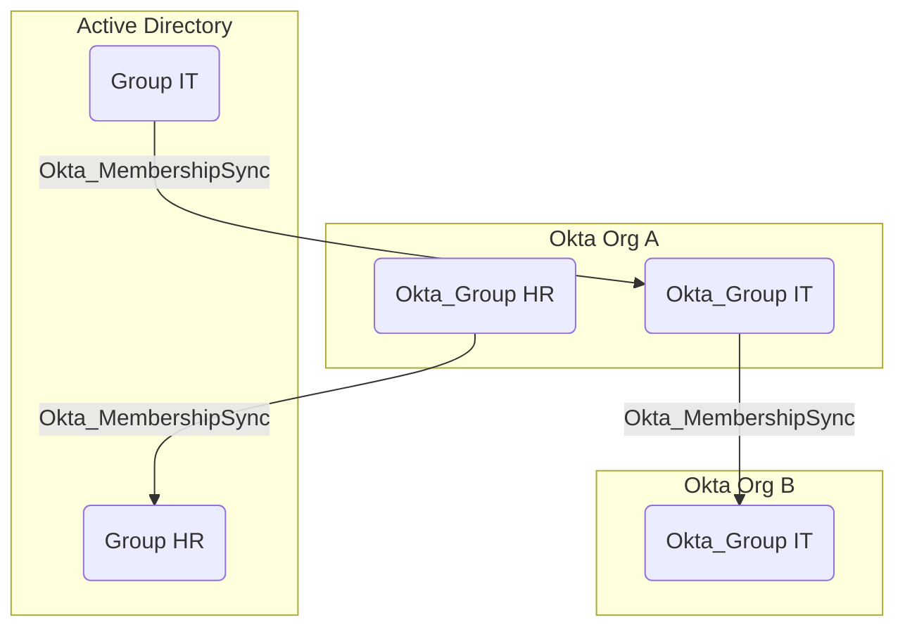
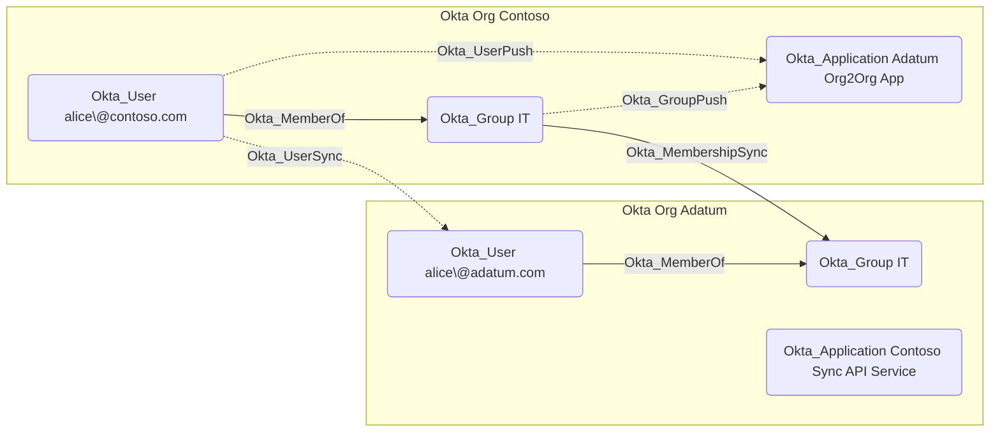

## Edge Schema

- Source: [Okta_Group](https://github.com/SpecterOps/bloodhound-docs/blob/main//opengraph/extensions/okta/nodes/okta_group), [Group](https://github.com/SpecterOps/bloodhound-docs/blob/main//resources/nodes/group), [AZGroup](https://github.com/SpecterOps/bloodhound-docs/blob/main//resources/nodes/az-group)
- Destination: [Okta_Group](https://github.com/SpecterOps/bloodhound-docs/blob/main//opengraph/extensions/okta/nodes/okta_group), [Group](https://github.com/SpecterOps/bloodhound-docs/blob/main//resources/nodes/group), [AZGroup](https://github.com/SpecterOps/bloodhound-docs/blob/main//resources/nodes/az-group)
- Traversable: ✅

## General Information

The traversable hybrid Okta_MembershipSync edges represent the synchronization relationships between groups in external directories and their corresponding groups in Okta:

