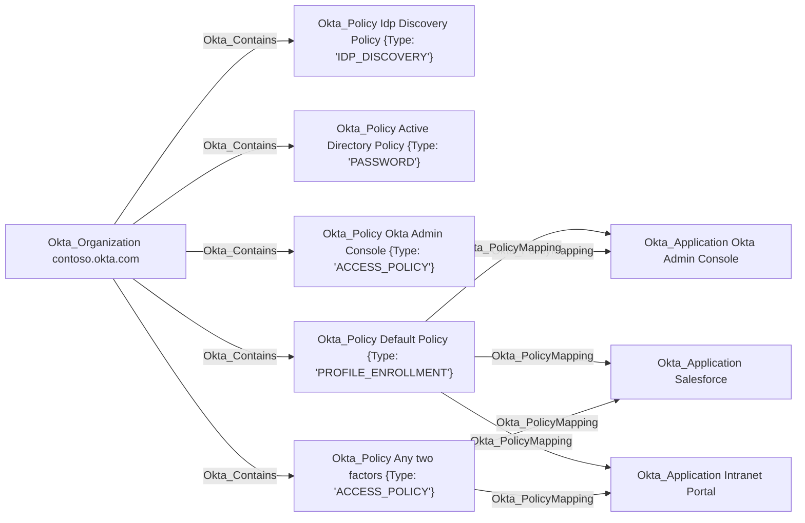

## Edge Schema

- Source: [Okta_Policy](https://github.com/SpecterOps/bloodhound-docs/blob/main//opengraph/extensions/okta/nodes/okta_policy)
- Destination: [Okta_Application](https://github.com/SpecterOps/bloodhound-docs/blob/main//opengraph/extensions/okta/nodes/okta_application)
- Traversable: ❌

## General Information

The non-traversable Okta_PolicyMapping edges represent the association between a policy and the resources to which it is applied.

<Info>
Only application targets are supported in the current version of the Okta BloodHound extension.
</Info>

