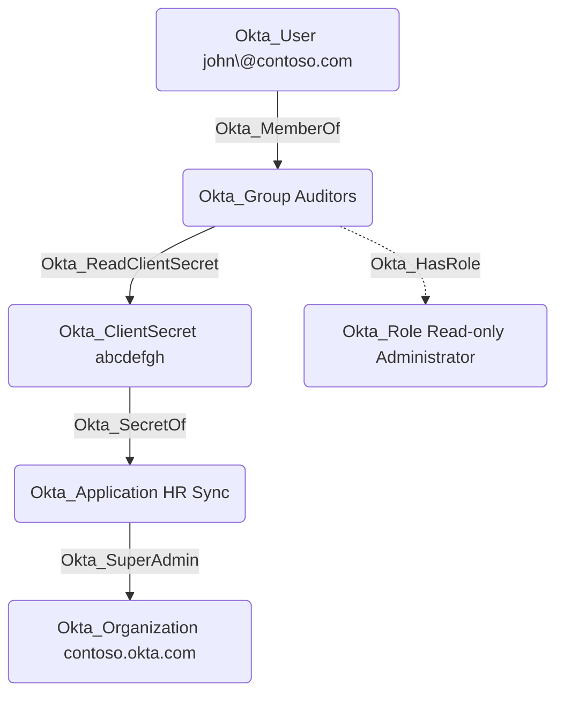

## Edge Schema

- Source: [Okta_User](https://github.com/SpecterOps/bloodhound-docs/blob/main//opengraph/extensions/okta/nodes/okta_user), [Okta_Group](https://github.com/SpecterOps/bloodhound-docs/blob/main//opengraph/extensions/okta/nodes/okta_group), [Okta_Application](https://github.com/SpecterOps/bloodhound-docs/blob/main//opengraph/extensions/okta/nodes/okta_application)
- Destination: [Okta_ClientSecret](https://github.com/SpecterOps/bloodhound-docs/blob/main//opengraph/extensions/okta/nodes/okta_clientsecret)
- Traversable: ✅

## General Information

The traversable Okta_ReadClientSecret edges represent permissions that allow a principal (user, group, or application) to read OAuth client secrets for scoped Okta applications. These edges are created for the **Application Administrator**, **API Access Management Administrator**, and **Read-only Administrator** built-in roles and for custom roles with the `okta.apps.clientCredentials.read` permission.

## Potential Attack Scenarios

An attacker with the ability to read client secrets for an application assigned the Super Administrator role could potentially use the client secret to authenticate as that application and perform privileged actions in Okta.
## Potential Attack Scenarios

An attacker with the ability to read client secrets for an application assigned the Super Administrator role
could potentially use the client secret to authenticate as that application and perform privileged actions in Okta.
