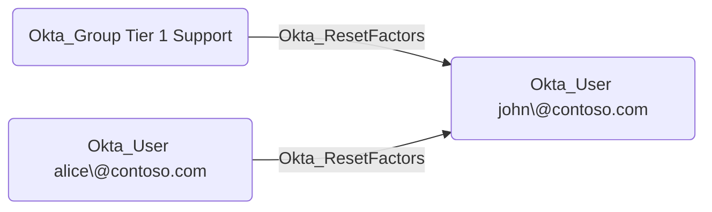

## Edge Schema

- Source: [Okta_User](https://github.com/SpecterOps/bloodhound-docs/blob/main//opengraph/extensions/okta/nodes/okta_user), [Okta_Group](https://github.com/SpecterOps/bloodhound-docs/blob/main//opengraph/extensions/okta/nodes/okta_group), [Okta_Application](https://github.com/SpecterOps/bloodhound-docs/blob/main//opengraph/extensions/okta/nodes/okta_application)
- Destination: [Okta_User](https://github.com/SpecterOps/bloodhound-docs/blob/main//opengraph/extensions/okta/nodes/okta_user)
- Traversable: ✅

## General Information

The traversable Okta_ResetFactors edges represent custom role permissions that allow a principal to reset MFA authenticators for scoped Okta users. These edges are created when a custom role includes the `okta.users.credentials.resetFactors` or `okta.users.credentials.manage` permissions.

