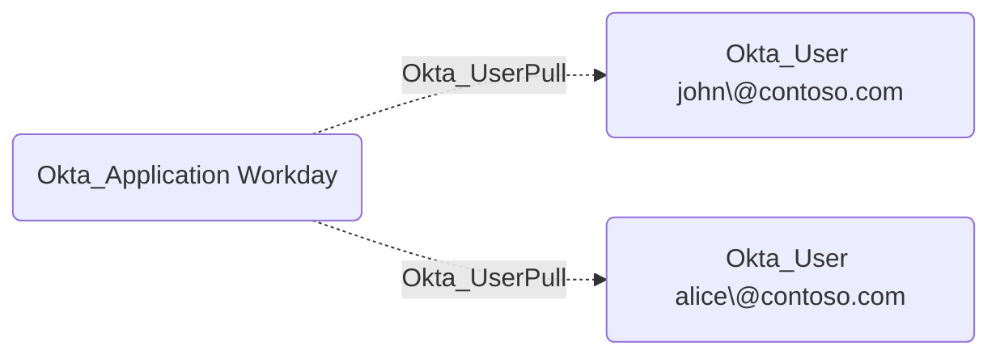

## Edge Schema

- Source: [Okta_Application](https://github.com/SpecterOps/bloodhound-docs/blob/main//opengraph/extensions/okta/nodes/okta_application)
- Destination: [Okta_User](https://github.com/SpecterOps/bloodhound-docs/blob/main//opengraph/extensions/okta/nodes/okta_user)
- Traversable: ❌

## General Information

The Okta_UserPull edges represent user import relationships from external applications to Okta.

