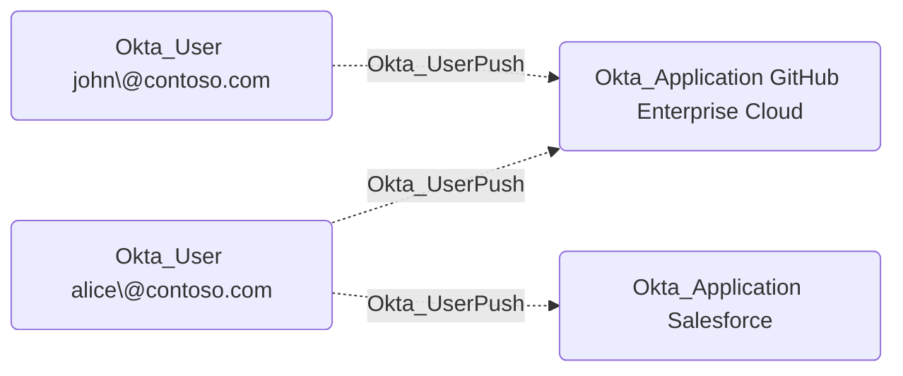

## Edge Schema

- Source: [Okta_User](https://github.com/SpecterOps/bloodhound-docs/blob/main//opengraph/extensions/okta/nodes/okta_user)
- Destination: [Okta_Application](https://github.com/SpecterOps/bloodhound-docs/blob/main//opengraph/extensions/okta/nodes/okta_application)
- Traversable: ❌

## General Information

The non-traversable Okta_UserPush edges represent user provisioning relationships from Okta to external applications. When configured, Okta can automatically create, update, or deactivate user accounts in integrated applications using protocols like SCIM or LDAP.

