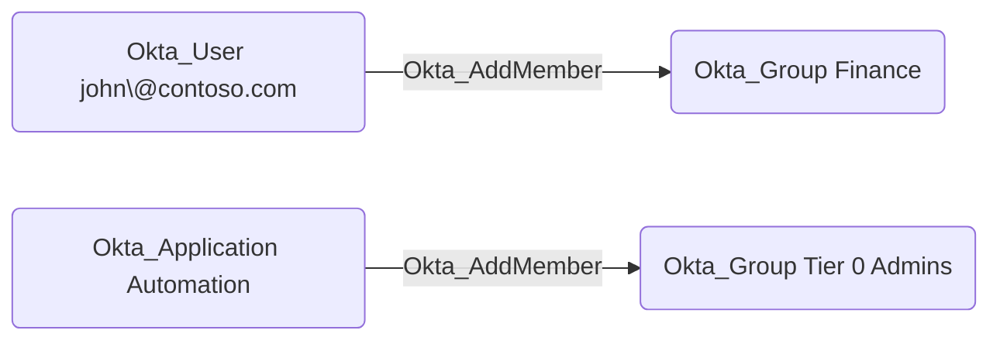

## Edge Schema

- Source: [Okta_User](https://github.com/SpecterOps/bloodhound-docs/blob/main//opengraph/extensions/oktahound/reference/nodes/okta_user), [Okta_Group](https://github.com/SpecterOps/bloodhound-docs/blob/main//opengraph/extensions/oktahound/reference/nodes/okta_group), [Okta_Application](https://github.com/SpecterOps/bloodhound-docs/blob/main//opengraph/extensions/oktahound/reference/nodes/okta_application)
- Destination: [Okta_Group](https://github.com/SpecterOps/bloodhound-docs/blob/main//opengraph/extensions/oktahound/reference/nodes/okta_group)
- Traversable: ✅

## General Information

The traversable `Okta_AddMember` edges represent custom role permissions that allow a principal (user, group, or application)
to add or remove members in scoped Okta groups. These edges are created when a custom role includes
the `okta.groups.members.manage` or `okta.groups.manage` permissions.

