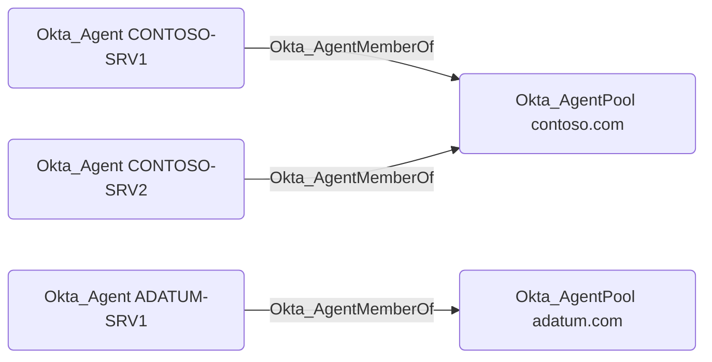

## Edge Schema

- Source: [Okta_Agent](https://github.com/SpecterOps/bloodhound-docs/blob/main//opengraph/extensions/oktahound/reference/nodes/okta_agent)
- Destination: [Okta_AgentPool](https://github.com/SpecterOps/bloodhound-docs/blob/main//opengraph/extensions/oktahound/reference/nodes/okta_agentpool)
- Traversable: ✅

## General Information

`Okta_AgentMemberOf` edges represent membership of an `Okta_Agent` in an `Okta_AgentPool`.

Active Directory Agent Pools and their agents can be visualized in BloodHound as follows:

<Warning>
Traversable edges between the `Okta_AgentPool` and AD `Domain` nodes are not created in the current version of `OktaHound`.
This functionality is planned for a future release.
</Warning>
