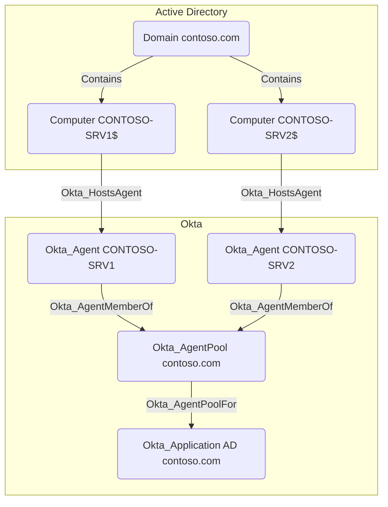

## Edge Schema

- Source: [Okta_AgentPool](https://github.com/SpecterOps/bloodhound-docs/blob/main//opengraph/extensions/oktahound/reference/nodes/okta_agentpool)
- Destination: [Okta_Application](https://github.com/SpecterOps/bloodhound-docs/blob/main//opengraph/extensions/oktahound/reference/nodes/okta_application)
- Traversable: ✅

## General Information

`Okta_AgentPoolFor` edges connect an AD `Okta_AgentPool` to the backing `Okta_Application` used for directory integration.

