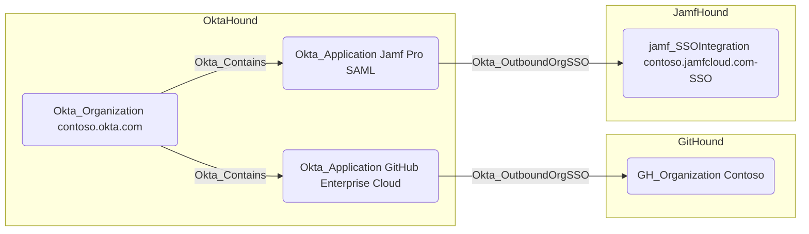

## Edge Schema

- Source: [Okta_Application](https://github.com/SpecterOps/bloodhound-docs/blob/main//opengraph/extensions/oktahound/reference/nodes/okta_application)
- Destination: [AZTenant](https://github.com/SpecterOps/bloodhound-docs/blob/main//resources/nodes/az-tenant), [GH_Organization](https://github.com/SpecterOps/GitHound), [jamf_SSOIntegration](https://github.com/SpecterOps/JamfHound), [SNOW_Account](https://github.com/SpecterOps/SnowHound), [Okta_IdentityProvider](https://github.com/SpecterOps/bloodhound-docs/blob/main//opengraph/extensions/oktahound/reference/nodes/okta_identityprovider)
- Traversable: ✅

## General Information

The traversable `Okta_OutboundOrgSSO` edges represent the Single Sign-On (SSO) relationships between Okta applications and supported external organizations or tenants, such as GitHub Enterprise or Jamf Pro, using SAML 2.0 or OIDC protocols.

The respective BloodHound collectors, e.g., `GitHound` for GitHub organizations and `JamfHound` for Jamf Pro tenants,
must be used to gather the external node information.
