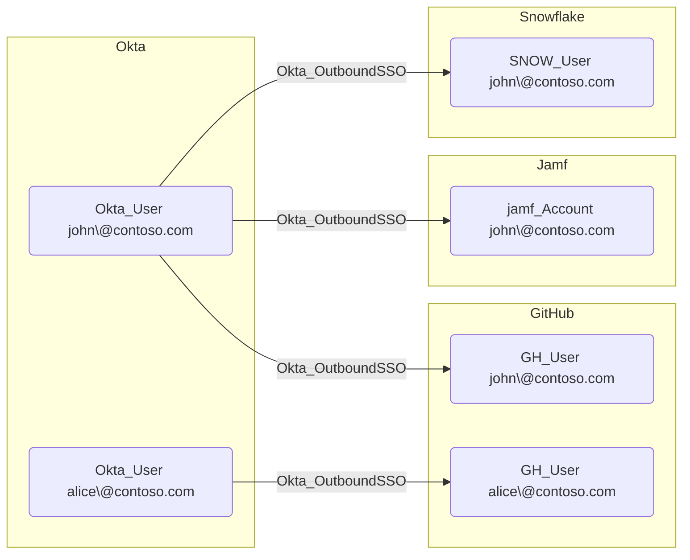

## Edge Schema

- Source: [Okta_User](https://github.com/SpecterOps/bloodhound-docs/blob/main//opengraph/extensions/oktahound/reference/nodes/okta_user)
- Destination: [AZUser](https://bloodhound.specterops.io/resources/nodes/az-user), [GH_User](https://github.com/SpecterOps/GitHound), [jamf_Account](https://github.com/SpecterOps/JamfHound), [SNOW_User](https://github.com/SpecterOps/SnowHound), [Okta_User](https://github.com/SpecterOps/bloodhound-docs/blob/main//opengraph/extensions/oktahound/reference/nodes/okta_user)
- Traversable: ✅

## General Information

The traversable hybrid `Okta_OutboundSSO` edges represent Single Sign-On relationships between Okta users and their linked accounts in external applications using federated authentication (SAML 2.0 or OIDC).

