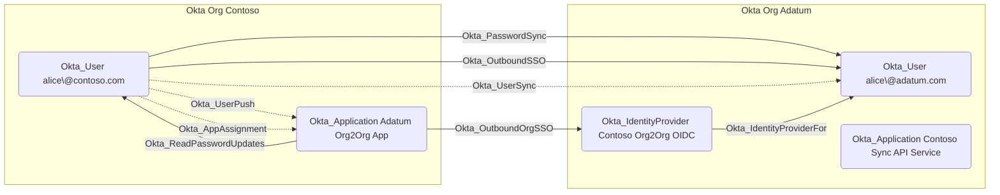

## Edge Schema

- Source: [Okta_User](https://github.com/SpecterOps/bloodhound-docs/blob/main//opengraph/extensions/oktahound/reference/nodes/okta_user)
- Destination: [Okta_User](https://github.com/SpecterOps/bloodhound-docs/blob/main//opengraph/extensions/oktahound/reference/nodes/okta_user)
- Traversable: ✅

## General Information

The traversable `Okta_PasswordSync` edge represents password synchronization between Okta users across organizations in Org2Org setups.
This indicates that credentials are synchronized from a source Okta user to a target Okta user.

> ![WARNING]
> The Okta API does not indicate if the actual password or a randomly generated value is pushed to the other organization.

