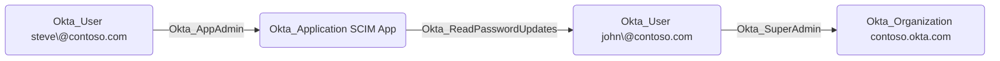

## Edge Schema

- Source: [Okta_Application](https://github.com/SpecterOps/bloodhound-docs/blob/main//opengraph/extensions/oktahound/reference/nodes/okta_application)
- Destination: [Okta_User](https://github.com/SpecterOps/bloodhound-docs/blob/main//opengraph/extensions/oktahound/reference/nodes/okta_user)
- Traversable: ✅

## General Information

The traversable `Okta_ReadPasswordUpdates` edges represent applications that can read password updates over SCIM.

