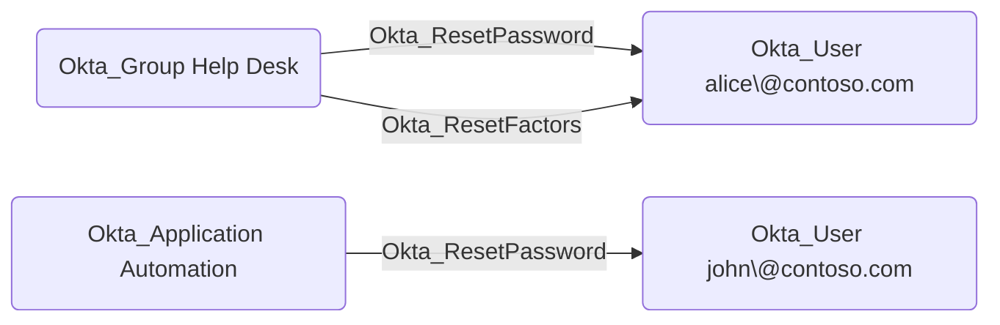

## Edge Schema

- Source: [Okta_User](https://github.com/SpecterOps/bloodhound-docs/blob/main//opengraph/extensions/oktahound/reference/nodes/okta_user), [Okta_Group](https://github.com/SpecterOps/bloodhound-docs/blob/main//opengraph/extensions/oktahound/reference/nodes/okta_group), [Okta_Application](https://github.com/SpecterOps/bloodhound-docs/blob/main//opengraph/extensions/oktahound/reference/nodes/okta_application)
- Destination: [Okta_User](https://github.com/SpecterOps/bloodhound-docs/blob/main//opengraph/extensions/oktahound/reference/nodes/okta_user)
- Traversable: ✅

## General Information

The traversable `Okta_ResetPassword` edges represent custom role permissions that allow a principal (user, group, or application)
to reset passwords or temporary credentials for scoped Okta users.
These edges are created when a custom role includes
password management permissions such as `okta.users.credentials.resetPassword`, `okta.users.credentials.manage`, `okta.users.credentials.manageTemporaryAccessCode`, or `okta.users.manage`.

