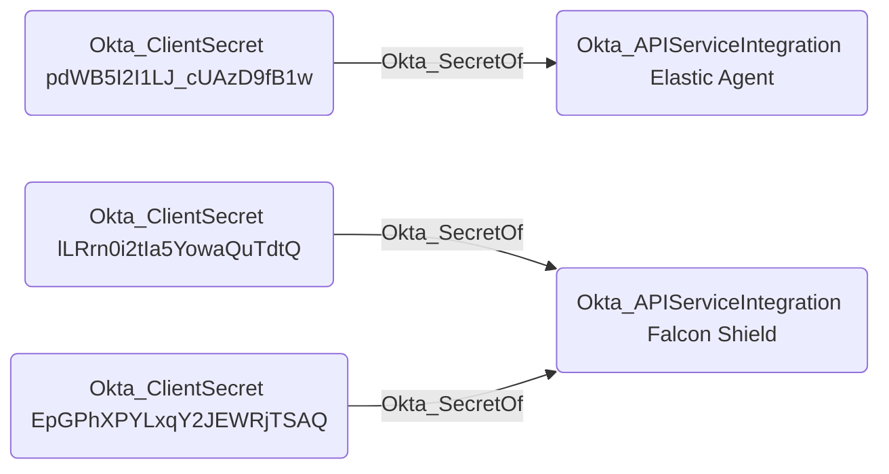

## Edge Schema

- Source: [Okta_ClientSecret](https://github.com/SpecterOps/bloodhound-docs/blob/main//opengraph/extensions/oktahound/reference/nodes/okta_clientsecret)
- Destination: [Okta_Application](https://github.com/SpecterOps/bloodhound-docs/blob/main//opengraph/extensions/oktahound/reference/nodes/okta_application), [Okta_ApiServiceIntegration](https://github.com/SpecterOps/bloodhound-docs/blob/main//opengraph/extensions/oktahound/reference/nodes/okta_apiserviceintegration)
- Traversable: ✅

## General Information

The traversable `Okta_SecretOf` edges represent the relationship between service applications or API service integrations and their associated client secrets, represented by the [Okta_ClientSecret](https://github.com/SpecterOps/bloodhound-docs/blob/main/../nodes/okta_clientsecret) nodes.

