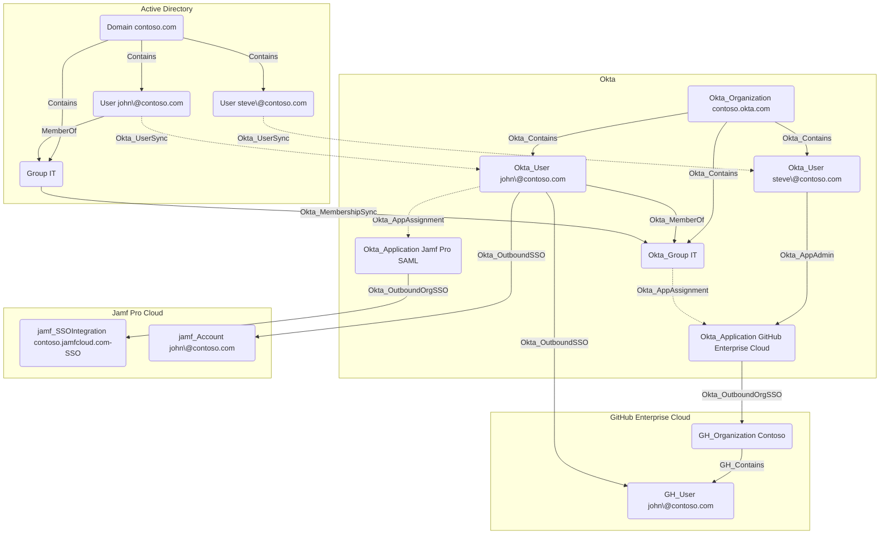

## Overview

Applications in Okta represent the various software applications and services that users can access through the Okta organization. Applications can be configured to use different authentication methods, such as SAML, OIDC, or SWA. These protocols can either be configured manually by administrators or automatically by adding an application from Okta's App Integration Catalog, which provides a wide range of pre-configured cloud and on-premises application templates.

With the exception of API Service applications, Okta users and groups can be assigned to applications. Users can also be synchronized TO and FROM applications in Okta, typically using the SCIM protocol. For example, when integrating with GitHub Enterprise Cloud, Okta can be configured to automatically create user accounts in GitHub when users are assigned to the GitHub application in Okta.

In `OktaHound`, applications are represented as `Okta_Application` nodes.

## Edges

<Note>
The tables below list edges defined by the OktaHound extension only. Additional edges to or from this node may be created by other extensions.
</Note>

### Inbound Edges

| Edge Type | Source Node Types | Traversable |
| --------- | ----------------- | ----------- |
| [Okta_AgentPoolFor](https://github.com/SpecterOps/bloodhound-docs/blob/main//opengraph/extensions/oktahound/reference/edges/okta_agentpoolfor) | [Okta_AgentPool](https://github.com/SpecterOps/bloodhound-docs/blob/main//opengraph/extensions/oktahound/reference/nodes/okta_agentpool) | ✅ |
| [Okta_AppAdmin](https://github.com/SpecterOps/bloodhound-docs/blob/main//opengraph/extensions/oktahound/reference/edges/okta_appadmin) | [Okta_User](https://github.com/SpecterOps/bloodhound-docs/blob/main//opengraph/extensions/oktahound/reference/nodes/okta_user), [Okta_Group](https://github.com/SpecterOps/bloodhound-docs/blob/main//opengraph/extensions/oktahound/reference/nodes/okta_group), [Okta_Application](https://github.com/SpecterOps/bloodhound-docs/blob/main//opengraph/extensions/oktahound/reference/nodes/okta_application) | ✅ |
| [Okta_AppAssignment](https://github.com/SpecterOps/bloodhound-docs/blob/main//opengraph/extensions/oktahound/reference/edges/okta_appassignment) | [Okta_User](https://github.com/SpecterOps/bloodhound-docs/blob/main//opengraph/extensions/oktahound/reference/nodes/okta_user), [Okta_Group](https://github.com/SpecterOps/bloodhound-docs/blob/main//opengraph/extensions/oktahound/reference/nodes/okta_group) | ❌ |
| [Okta_Contains](https://github.com/SpecterOps/bloodhound-docs/blob/main//opengraph/extensions/oktahound/reference/edges/okta_contains) | [Okta_Organization](https://github.com/SpecterOps/bloodhound-docs/blob/main//opengraph/extensions/oktahound/reference/nodes/okta_organization) | ✅ |
| [Okta_GroupPush](https://github.com/SpecterOps/bloodhound-docs/blob/main//opengraph/extensions/oktahound/reference/edges/okta_grouppush) | [Okta_Group](https://github.com/SpecterOps/bloodhound-docs/blob/main//opengraph/extensions/oktahound/reference/nodes/okta_group) | ❌ |
| [Okta_KerberosSSO](https://github.com/SpecterOps/bloodhound-docs/blob/main//opengraph/extensions/oktahound/reference/edges/okta_kerberossso) | [User](https://github.com/SpecterOps/bloodhound-docs/blob/main//resources/nodes/user) | ✅ |
| [Okta_KeyOf](https://github.com/SpecterOps/bloodhound-docs/blob/main//opengraph/extensions/oktahound/reference/edges/okta_keyof) | [Okta_JWK](https://github.com/SpecterOps/bloodhound-docs/blob/main//opengraph/extensions/oktahound/reference/nodes/okta_jwk) | ✅ |
| [Okta_ManageApp](https://github.com/SpecterOps/bloodhound-docs/blob/main//opengraph/extensions/oktahound/reference/edges/okta_manageapp) | [Okta_User](https://github.com/SpecterOps/bloodhound-docs/blob/main//opengraph/extensions/oktahound/reference/nodes/okta_user), [Okta_Group](https://github.com/SpecterOps/bloodhound-docs/blob/main//opengraph/extensions/oktahound/reference/nodes/okta_group), [Okta_Application](https://github.com/SpecterOps/bloodhound-docs/blob/main//opengraph/extensions/oktahound/reference/nodes/okta_application) | ✅ |
| [Okta_PolicyMapping](https://github.com/SpecterOps/bloodhound-docs/blob/main//opengraph/extensions/oktahound/reference/edges/okta_policymapping) | [Okta_Policy](https://github.com/SpecterOps/bloodhound-docs/blob/main//opengraph/extensions/oktahound/reference/nodes/okta_policy) | ❌ |
| [Okta_ResourceSetContains](https://github.com/SpecterOps/bloodhound-docs/blob/main//opengraph/extensions/oktahound/reference/edges/okta_resourcesetcontains) | [Okta_ResourceSet](https://github.com/SpecterOps/bloodhound-docs/blob/main//opengraph/extensions/oktahound/reference/nodes/okta_resourceset) | ✅ |
| [Okta_ScopedTo](https://github.com/SpecterOps/bloodhound-docs/blob/main//opengraph/extensions/oktahound/reference/edges/okta_scopedto) | [Okta_RoleAssignment](https://github.com/SpecterOps/bloodhound-docs/blob/main//opengraph/extensions/oktahound/reference/nodes/okta_roleassignment) | ❌ |
| [Okta_SecretOf](https://github.com/SpecterOps/bloodhound-docs/blob/main//opengraph/extensions/oktahound/reference/edges/okta_secretof) | [Okta_ClientSecret](https://github.com/SpecterOps/bloodhound-docs/blob/main//opengraph/extensions/oktahound/reference/nodes/okta_clientsecret) | ✅ |
| [Okta_UserPush](https://github.com/SpecterOps/bloodhound-docs/blob/main//opengraph/extensions/oktahound/reference/edges/okta_userpush) | [Okta_User](https://github.com/SpecterOps/bloodhound-docs/blob/main//opengraph/extensions/oktahound/reference/nodes/okta_user) | ❌ |

### Outbound Edges

| Edge Type | Destination Node Types | Traversable |
| --------- | ---------------------- | ----------- |
| [Okta_AddMember](https://github.com/SpecterOps/bloodhound-docs/blob/main//opengraph/extensions/oktahound/reference/edges/okta_addmember) | [Okta_Group](https://github.com/SpecterOps/bloodhound-docs/blob/main//opengraph/extensions/oktahound/reference/nodes/okta_group) | ✅ |
| [Okta_AppAdmin](https://github.com/SpecterOps/bloodhound-docs/blob/main//opengraph/extensions/oktahound/reference/edges/okta_appadmin) | [Okta_Application](https://github.com/SpecterOps/bloodhound-docs/blob/main//opengraph/extensions/oktahound/reference/nodes/okta_application), [Okta_ApiServiceIntegration](https://github.com/SpecterOps/bloodhound-docs/blob/main//opengraph/extensions/oktahound/reference/nodes/okta_apiserviceintegration) | ✅ |
| [Okta_CreatorOf](https://github.com/SpecterOps/bloodhound-docs/blob/main//opengraph/extensions/oktahound/reference/edges/okta_creatorof) | [Okta_ApiServiceIntegration](https://github.com/SpecterOps/bloodhound-docs/blob/main//opengraph/extensions/oktahound/reference/nodes/okta_apiserviceintegration) | ❌ |
| [Okta_GroupAdmin](https://github.com/SpecterOps/bloodhound-docs/blob/main//opengraph/extensions/oktahound/reference/edges/okta_groupadmin) | [Okta_User](https://github.com/SpecterOps/bloodhound-docs/blob/main//opengraph/extensions/oktahound/reference/nodes/okta_user), [Okta_Group](https://github.com/SpecterOps/bloodhound-docs/blob/main//opengraph/extensions/oktahound/reference/nodes/okta_group) | ✅ |
| [Okta_GroupMembershipAdmin](https://github.com/SpecterOps/bloodhound-docs/blob/main//opengraph/extensions/oktahound/reference/edges/okta_groupmembershipadmin) | [Okta_Group](https://github.com/SpecterOps/bloodhound-docs/blob/main//opengraph/extensions/oktahound/reference/nodes/okta_group) | ✅ |
| [Okta_GroupPull](https://github.com/SpecterOps/bloodhound-docs/blob/main//opengraph/extensions/oktahound/reference/edges/okta_grouppull) | [Okta_Group](https://github.com/SpecterOps/bloodhound-docs/blob/main//opengraph/extensions/oktahound/reference/nodes/okta_group) | ✅ |
| [Okta_HasRole](https://github.com/SpecterOps/bloodhound-docs/blob/main//opengraph/extensions/oktahound/reference/edges/okta_hasrole) | [Okta_Role](https://github.com/SpecterOps/bloodhound-docs/blob/main//opengraph/extensions/oktahound/reference/nodes/okta_role), [Okta_CustomRole](https://github.com/SpecterOps/bloodhound-docs/blob/main//opengraph/extensions/oktahound/reference/nodes/okta_customrole) | ❌ |
| [Okta_HasRoleAssignment](https://github.com/SpecterOps/bloodhound-docs/blob/main//opengraph/extensions/oktahound/reference/edges/okta_hasroleassignment) | [Okta_RoleAssignment](https://github.com/SpecterOps/bloodhound-docs/blob/main//opengraph/extensions/oktahound/reference/nodes/okta_roleassignment) | ❌ |
| [Okta_HelpDeskAdmin](https://github.com/SpecterOps/bloodhound-docs/blob/main//opengraph/extensions/oktahound/reference/edges/okta_helpdeskadmin) | [Okta_User](https://github.com/SpecterOps/bloodhound-docs/blob/main//opengraph/extensions/oktahound/reference/nodes/okta_user) | ✅ |
| [Okta_ManageApp](https://github.com/SpecterOps/bloodhound-docs/blob/main//opengraph/extensions/oktahound/reference/edges/okta_manageapp) | [Okta_Application](https://github.com/SpecterOps/bloodhound-docs/blob/main//opengraph/extensions/oktahound/reference/nodes/okta_application) | ✅ |
| [Okta_MobileAdmin](https://github.com/SpecterOps/bloodhound-docs/blob/main//opengraph/extensions/oktahound/reference/edges/okta_mobileadmin) | [Okta_Device](https://github.com/SpecterOps/bloodhound-docs/blob/main//opengraph/extensions/oktahound/reference/nodes/okta_device) | ✅ |
| [Okta_OrgAdmin](https://github.com/SpecterOps/bloodhound-docs/blob/main//opengraph/extensions/oktahound/reference/edges/okta_orgadmin) | [Okta_User](https://github.com/SpecterOps/bloodhound-docs/blob/main//opengraph/extensions/oktahound/reference/nodes/okta_user), [Okta_Group](https://github.com/SpecterOps/bloodhound-docs/blob/main//opengraph/extensions/oktahound/reference/nodes/okta_group), [Okta_Device](https://github.com/SpecterOps/bloodhound-docs/blob/main//opengraph/extensions/oktahound/reference/nodes/okta_device) | ✅ |
| [Okta_OrgSWA](https://github.com/SpecterOps/bloodhound-docs/blob/main//opengraph/extensions/oktahound/reference/edges/okta_orgswa) | [GH_Organization](https://github.com/SpecterOps/GitHound), [jamf_SSOIntegration](https://github.com/SpecterOps/JamfHound), [OP_Account](https://github.com/SpecterOps/1PassHound), [SNOW_Account](https://github.com/SpecterOps/SnowHound) | ❌ |
| [Okta_OutboundOrgSSO](https://github.com/SpecterOps/bloodhound-docs/blob/main//opengraph/extensions/oktahound/reference/edges/okta_outboundorgsso) | [AZTenant](https://github.com/SpecterOps/bloodhound-docs/blob/main//resources/nodes/az-tenant), [GH_Organization](https://github.com/SpecterOps/GitHound), [jamf_SSOIntegration](https://github.com/SpecterOps/JamfHound), [SNOW_Account](https://github.com/SpecterOps/SnowHound), [Okta_IdentityProvider](https://github.com/SpecterOps/bloodhound-docs/blob/main//opengraph/extensions/oktahound/reference/nodes/okta_identityprovider) | ✅ |
| [Okta_ReadClientSecret](https://github.com/SpecterOps/bloodhound-docs/blob/main//opengraph/extensions/oktahound/reference/edges/okta_readclientsecret) | [Okta_ClientSecret](https://github.com/SpecterOps/bloodhound-docs/blob/main//opengraph/extensions/oktahound/reference/nodes/okta_clientsecret) | ✅ |
| [Okta_ReadPasswordUpdates](https://github.com/SpecterOps/bloodhound-docs/blob/main//opengraph/extensions/oktahound/reference/edges/okta_readpasswordupdates) | [Okta_User](https://github.com/SpecterOps/bloodhound-docs/blob/main//opengraph/extensions/oktahound/reference/nodes/okta_user) | ✅ |
| [Okta_ResetFactors](https://github.com/SpecterOps/bloodhound-docs/blob/main//opengraph/extensions/oktahound/reference/edges/okta_resetfactors) | [Okta_User](https://github.com/SpecterOps/bloodhound-docs/blob/main//opengraph/extensions/oktahound/reference/nodes/okta_user) | ✅ |
| [Okta_ResetPassword](https://github.com/SpecterOps/bloodhound-docs/blob/main//opengraph/extensions/oktahound/reference/edges/okta_resetpassword) | [Okta_User](https://github.com/SpecterOps/bloodhound-docs/blob/main//opengraph/extensions/oktahound/reference/nodes/okta_user) | ✅ |
| [Okta_SuperAdmin](https://github.com/SpecterOps/bloodhound-docs/blob/main//opengraph/extensions/oktahound/reference/edges/okta_superadmin) | [Okta_Organization](https://github.com/SpecterOps/bloodhound-docs/blob/main//opengraph/extensions/oktahound/reference/nodes/okta_organization) | ✅ |
| [Okta_UserPull](https://github.com/SpecterOps/bloodhound-docs/blob/main//opengraph/extensions/oktahound/reference/edges/okta_userpull) | [Okta_User](https://github.com/SpecterOps/bloodhound-docs/blob/main//opengraph/extensions/oktahound/reference/nodes/okta_user) | ❌ |

## Properties

### Common Application Properties

| Name | Source | Type | Description |
| ---- | ------ | ---- | ----------- |
| `id` | `application.id` | `string` | Unique application identifier. |
| `name` | `application.label` | `string` | Name/label of the Okta application. |
| `displayName` | `application.label` | `string` | Display label used in BloodHound. |
| `oktaDomain` | Collector context (non-API) | `string` | Okta organization domain where the application exists. |
| `hasRoleAssignments` | Calculated | `bool` | Indicates whether the application is assigned any administrative roles. |
| `created` | `application.created` | `datetime` | Application creation timestamp. |
| `lastUpdated` | `application.lastUpdated` | `datetime` | Last update timestamp of the app definition. |
| `status` | `application.status` | `string` | Current lifecycle status of the application instance. |
| `signOnMode` | `application.signOnMode` | `string` | Sign-on protocol mode (for example `OPENID_CONNECT`, `SAML_2_0`, `AUTO_LOGIN`). |
| `features` | `application.features` | `string[]` | Enabled app capabilities such as SCIM provisioning and password push. |
| `appType` | `application.name` | `string` | App type identifier (for example `office365`, `snowflake`, `githubcloud`). |
| `userNameMapping` | `application.credentials.userNameTemplate.template` | `string` | Username mapping template used for provisioning/federation. |

Individual application types may have additional properties specific to the integration or protocol:

### GitHub Cloud

| Name | Source | Type | Description |
| ---- | ------ | ---- | ----------- |
| `githubOrg` | `application.settings.app.githubOrg` | `string` | GitHub organization mapped to the integration. |

### Google Workspace

| Name | Source | Type | Description |
| ---- | ------ | ---- | ----------- |
| `domain` | `application.settings.app.domain` | `string` | Google Workspace domain associated with the integration. |
| `afwOnly` | `application.settings.app.afwOnly` | `bool` | App-specific flag indicating constrained integration behavior. |

### Jamf Pro SAML

| Name | Source | Type | Description |
| ---- | ------ | ---- | ----------- |
| `domain` | `application.settings.app.domain` | `string` | Jamf Pro tenant domain associated with the integration. |

### Active Directory Integration

| Name | Source | Type | Description |
| ---- | ------ | ---- | ----------- |
| `namingContext` | `application.settings.app.namingContext` | `string` | Naming context configured for AD-backed app integration. |
| `filterGroupsByOU` | `application.settings.app.filterGroupsByOU` | `bool` | Whether group filtering by OU is enabled. |
| `domainSid` | Derived from synced AD user/group SID values (not directly in app object) | `string` | Domain SID associated with AD-backed integration. |
| `windowsTransportEnabled` | `application.settings.app.windowsTransportEnabled` | `bool` | Indicates if Windows transport is enabled. |

### Generic SAML Application

| Name | Source | Type | Description |
| ---- | ------ | ---- | ----------- |
| `url` | `application.settings.signOn.ssoAcsUrl` (SAML 2.0) / `application.settings.signOn.ssoAcsUrlOverride` (SAML 1.1) | `string` | Primary sign-on URL exposed for SAML applications. |
| `entityID` | `application.settings.signOn.destination` / `application.settings.signOn.audience` | `string` | SAML Entity ID for SAML integrations. |
| `acsURL` | `application.settings.signOn.ssoAcsUrl` | `string` | Assertion Consumer Service (ACS) URL for SAML integrations. |
| `wsFedConfigureType` | `application.settings.app.wsFedConfigureType` | `string` | WS-Federation configuration mode. |

### Generic OIDC Service Application

| Name | Source | Type | Description |
| ---- | ------ | ---- | ----------- |
| `clientType` | `application.settings.oauthClient.applicationType` | `string` | OIDC client type (for example `web`, `native`, `browser`, `service`). |
| `grantTypes` | `application.settings.oauthClient.grantTypes[]` | `string[]` | OAuth 2.0 grant types allowed for OIDC apps. |
| `redirectURI` | `application.settings.oauthClient.redirectUris[]` | `string` | OIDC redirect URI configured for the integration. |
| `initiateLoginURI` | `application.settings.oauthClient.initiateLoginUri` | `string` | Okta-initiated login URI for supported OIDC apps. |
| `url` | Derived from OIDC sign-in URL preference (`initiateLoginUri` first, otherwise first `redirectUris[]`) | `string` | Primary sign-in URL exposed by OktaHound for OIDC applications. |
| `oauthScopes` | Derived from app grants in `PopulateOAuthScopes` / grant collection logic | `string[]` | OAuth scopes granted to the application in Okta. |
| `domain` | `application.settings.app.domain` | `string` | Directory or service domain associated with the app integration. |
| `domains` | `application.settings.app.domains` | `string[]` | Domain list associated with the app integration when provided. |
| `serviceDomain` | `application.settings.app.serviceDomain` | `string` | Service/API domain used by workflow or API-connected apps. |
| `subDomain` | `application.settings.app.subDomain` | `string` | Subdomain value used by app-specific integrations. |
| `regionType` | `application.settings.app.regionType` | `string` | Region suffix/type used by the app integration. |

### Microsoft Entra ID External Authentication

| Name | Source | Type | Description |
| ---- | ------ | ---- | ----------- |
| `microsoftDiscoveryEndpoint` | `application.settings.app.microsoftDiscoveryEndpoint` | `string` | OIDC discovery endpoint used by Microsoft integrations. |
| `microsoftAppId` | `application.settings.app.microsoftAppId` | `string` | Microsoft application/client ID configured in the integration. |
| `microsoftTenantId` | `application.settings.app.microsoftTenantId` | `string` | Microsoft Entra tenant GUID associated with the app integration. |
| `requireAdminConsent` | `application.settings.app.requireAdminConsent` | `bool` | Indicates if Microsoft admin consent is required. |

### Microsoft Office 365

| Name | Source | Type | Description |
| ---- | ------ | ---- | ----------- |
| `msftTenant` | `application.settings.app.msftTenant` | `string` | Microsoft tenant short name/domain used by the Office 365 integration. |
| `microsoftTenantId` | Calculated from `msftTenant` | `string` | Microsoft Entra tenant GUID resolved from the Office 365 onmicrosoft tenant. |

### Generic SWA / Browser Plugin Application

| Name | Source | Type | Description |
| ---- | ------ | ---- | ----------- |
| `loginURL` | `application.settings.app.loginUrl` | `string` | App login URL used by SWA/browser plugin configurations. |
| `url` | `application.settings.signOn.loginUrl` (AutoLogin) / `application.settings.app.url` (BrowserPlugin/BasicAuth/Bookmark/SPS) | `string` | Primary login URL exposed for SWA and related app types. |
| `appFilter` | `application.settings.app.appFilter` | `string` | App-side filter expression value. |
| `groupFilter` | `application.settings.app.groupFilter` | `string` | Group filter pattern used for provisioning/mapping. |
| `useGroupMapping` | `application.settings.app.useGroupMapping` | `bool` | Whether group mapping is enabled for integration. |
| `joinAllRoles` | `application.settings.app.joinAllRoles` | `bool` | Whether all discovered roles are joined/collected. |
| `roleValuePattern` | `application.settings.app.roleValuePattern` | `string` | Role mapping pattern template for AWS role federation. |
| `awsEnvironmentType` | `application.settings.app.awsEnvironmentType` | `string` | AWS environment identifier for AWS app integrations. |
| `sessionDuration` | `application.settings.app.sessionDuration` | `integer` | Session duration setting (seconds) for supported app integrations. |

## Sample Property Values

### Github Cloud

```yaml
id: 0oawyp12cjglrkfId697
name: Github Contoso
appType: githubcloud
displayName: Github Contoso
features: []
githubOrg: Contoso
hasRoleAssignments: false
oktaDomain: contoso.okta.com
signOnMode: SAML_2_0
status: ACTIVE
userNameMapping: ${source.login}
created: 2025-10-31T06:08:00+00:00
lastUpdated: 2025-10-31T06:08:01+00:00
```

### Google Workspace

```yaml
id: 0oax4r57x0V5NHL2W697
afwOnly: false
appType: google
displayName: Google Workspace
domain: contoso.com
features: []
hasRoleAssignments: false
name: Google Workspace
oktaDomain: contoso.okta.com
signOnMode: SAML_2_0
status: ACTIVE
userNameMapping: ${source.login}
created: 2025-11-05T09:06:48+00:00
lastUpdated: 2025-11-05T09:07:21+00:00
```

### Jamf Pro SAML

```yaml
id: 0oax4r3ud0J2WjlNh697
appType: jamfsoftwareserver
displayName: Jamf Pro SAML
domain: contoso.jamfcloud.com
features: []
hasRoleAssignments: false
name: Jamf Pro SAML
oktaDomain: contoso.okta.com
signOnMode: SAML_2_0
status: ACTIVE
userNameMapping: ${source.login}
created: 2025-11-05T09:10:52+00:00
lastUpdated: 2026-01-19T14:33:39+00:00
```

### OktaHound

```yaml
id: 0oaw0pujq5WtBiMYD697
name: OktaHound
appType: oidc_client
clientType: service
displayName: OktaHound
features: []
grantTypes:
  - client_credentials
hasRoleAssignments: true
oauthScopes:
  - okta.trustedOrigins.read
  - okta.policies.read
  - okta.linkedObjects.read
  - okta.authModes.read
  - okta.templates.read
  - okta.apiTokens.read
  - okta.factors.read
  - okta.brands.read
  - okta.authenticators.read
  - okta.uischemas.read
  - okta.logs.read
  - okta.groups.read
  - okta.identitySources.read
  - okta.users.read
  - okta.orgs.read
  - okta.threatInsights.read
  - okta.pushProviders.read
  - okta.apps.read
  - ssf.read
  - okta.roles.read
  - okta.networkZones.read
  - okta.emailDomains.read
  - okta.manifests.read
  - okta.oauthIntegrations.read
  - okta.domains.read
  - okta.deviceAssurance.read
  - okta.reports.read
  - okta.authorizationServers.read
  - okta.enduser.read
  - okta.schemas.read
  - okta.idps.read
  - okta.agentPools.read
  - okta.appGrants.read
  - okta.inlineHooks.read
  - okta.certificateAuthorities.read
  - okta.devices.read
  - okta.behaviors.read
  - okta.profileMappings.read
  - okta.captchas.read
  - okta.clients.read
  - okta.features.read
  - okta.sessions.read
  - okta.userTypes.read
oktaDomain: integrator-5415459.okta.com
signOnMode: OPENID_CONNECT
status: ACTIVE
userNameMapping: ${source.login}
created: 2025-10-02T10:11:20+00:00
lastUpdated: 2025-10-02T10:26:27+00:00
```

### Active Directory Integration

```yaml
id: 0oaxg9rhdd7ncGCXv697
name: contoso.local
appType: active_directory
displayName: contoso.local
domainSid: S-1-5-21-71365889-924527929-2677699343
features:
  - IMPORT_PROFILE_UPDATES
  - PROFILE_MASTERING
  - OUTBOUND_DEL_AUTH
  - IMPORT_USER_SCHEMA
  - IMPORT_NEW_USERS
filterGroupsByOU: false
hasRoleAssignments: false
namingContext: contoso.local
oktaDomain: contoso.okta.com
status: ACTIVE
created: 2025-11-14T12:50:42+00:00
lastUpdated: 2026-01-31T15:12:24+00:00
```

## User Name Mapping

User name mapping from Okta to SAML 2.0, OpenID Connect (OIDC), and Secure Web Authentication (SWA) applications is configurable in the Okta Admin Console, with the default setting being the Okta username pass-through, i.e., `${source.login}`.

| Application username format   | Mapping template                                            |
|-------------------------------|-------------------------------------------------------------|
| Okta username                 | `${source.login}`                                           |
| Email                         | `${source.email}`                                           |
| Okta username prefix          | `${fn:substringBefore(source.login, "@")}`                  |
| Email prefix                  | `${fn:substringBefore(source.email, "@")}`                  |
| AD Employee ID                | `${source.employeeID}`                                      |
| AD SAM account name           | `${source.samAccountName}`                                  |
| AD SAM account name + domain  | `${source.samAccountName}@${source.instance.namingContext}` |
| AD user principal name        | `${source.userName}`                                        |
| AD user principal name prefix | `${fn:substringBefore(source.userName, "@")}`               |
| (None)                        | `NONE`                                                      |
| Custom                        | ?                                                           |

## API Service Applications

This application type is the most interesting one from the security perspective, as it represents OAuth 2.0 service (daemon) applications that can be granted machine-to-machine access to Okta APIs, without any user interaction. These applications can be assigned administrative roles, e.g., Super Admin, and OAuth 2.0 scope grants, e.g., `okta.users.manage`. Any API operation must be allowed by both the assigned roles and the granted scopes.


## Hybrid Edges

For supported systems like Active Directory, GitHub Enterprise Cloud, or Jamf Pro,
OktaHound can create hybrid edges in BloodHound to represent the relationships between these external systems and Okta.



### Active Directory Synchronization

When Okta's Active Directory (AD) integration is configured for user and group synchronization,
the connected AD domain is represented as an `Okta_Application` node in BloodHound.
This allows you to visualize the AD-backed application alongside other applications in your Okta environment and understand its relationships with users, groups, and roles.

The synchronization is performed by domain-joined servers with the Okta AD Agent installed.
This agent typically has Domain Admin privileges in the connected AD domain to perform user and group enumeration and synchronization,
making it a high-value target for attackers.


Authentication can be delegated from Okta to AD in multiple ways:

- [Agentless Desktop SSO](https://help.okta.com/oie/en-us/content/topics/directory/ad-dsso-about-workflow.htm)
- [Password Synchronization](https://help.okta.com/oie/en-us/content/topics/directory/installing_configuring_active_directory_password_sync_agent.htm)
- Active Directory Federation Services (ADFS) integration with Okta as a SAML IdP

<Warning>
There is no documented API available to determine the authentication delegation method(s) configured for an AD-backed Okta application.
OktaHound therefore performs some heuristics that might not be 100% accurate in all cases.
</Warning>
### GitHub Enterprise Cloud Organizations

When integrating Okta with GitHub Enterprise Cloud, each GitHub organization connected to Okta is represented as a separate `Okta_Application` node in BloodHound.


### Jamf Pro

When integrating Okta with Jamf Pro using SAML 2.0, each Jamf Pro instance connected to Okta is represented as a separate `Okta_Application` node in BloodHound.
The differentiator is the `domainFQDN` property:


It is also possible to integrate Jamf Pro with Okta using Secure Web Authentication (SWA), but this option is less secure.


## Google Workspace

Similarly to the Jamf Pro SAML applications, each Google Workspace (formerly G Suite) instance connected to Okta using SAML 2.0 is represented as a separate `Okta_Application` node in BloodHound and is identified by the `domainFQDN` property:


The SAML 2.0 protocol should always be preferred to SWA when integrating Okta with Google Workspace:


## Generic SAML 2.0 Applications

The assertion consumer service (ACS) URLs of generic (non-Catalog) Okta SAML 2.0 applications are exposed via the `url` attribute in BloodHound.


## Generic Secure Web Authentication (SWA) Applications

Secure Web Authentication (SWA) is an Okta technology that provides Single Sign-On (SSO) functionality to external web applications that don't support federated protocols. SWA applications store user credentials in Okta and automatically fill them in when users access the application through the Okta dashboard.

The app's login page URL is exposed via the `url` attribute in BloodHound.


## Generic OpenID Connect (OIDC) Applications

Okta supports three types of OIDC applications:

- Web Application
- Single-Page Application (SPA)
- Native Application

The default redirect URI of generic (non-Catalog) Okta OIDC single-page applications (SPAs) starts with `http://localhost:8080/`, making it hard to identify the actual application address. The optional Okta-initiated sign-in flow URL is therefore exposed in the `url` attribute in BloodHound instead, if configured.

OIDC applications can be granted OAuth 2.0 scopes to access Okta APIs on behalf of users:


## SCIM-Enabled Applications

The `features` attribute of `Okta_Application` nodes may contain the following SCIM-related values,
indicating if SCIM is enabled and which protocol capabilities are supported:

| Feature                      | Description                                                                    |
|------------------------------|--------------------------------------------------------------------------------|
| PUSH_NEW_USERS               | Supports pushing new users from Okta to the application                        |
| PUSH_PASSWORD_UPDATES        | Supports pushing password updates from Okta to the application                 |
| PUSH_PENDING_USERS           | Supports pushing users from Okta to the application in pending state          |
| PUSH_PROFILE_UPDATES         | Supports pushing profile updates from Okta to the application                  |
| PUSH_USER_DEACTIVATION       | Supports pushing user deactivation from Okta to the application                |
| REACTIVATE_USERS             | Supports reactivating users in the application from Okta                       |
| IMPORT_NEW_USERS             | Supports importing new users into Okta from the application                    |
| OPP_SCIM_INCREMENTAL_IMPORTS | Supports incremental imports of users from the application into Okta           |
| IMPORT_PROFILE_UPDATES       | Updates a linked user's app profile in Okta during manual or scheduled imports |
| GROUP_PUSH                   | Supports pushing groups and group memberships from Okta to the application     |
| PROFILE_MASTERING            | Supports profile mastering in Okta, allowing the application to be the source of truth for user profiles |
