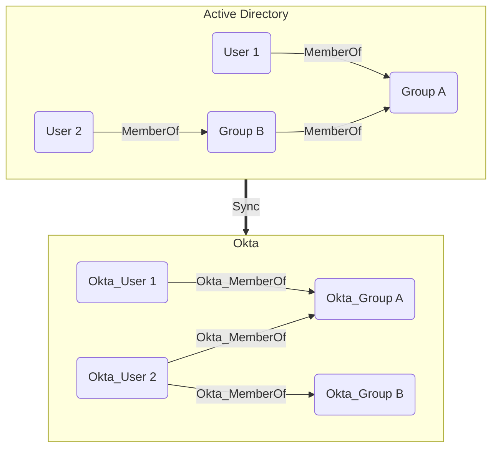

## Overview

Groups in Okta are collections of users that can be used to manage access to applications and resources. Groups can be created manually or synchronized from external directories such as Active Directory.
The built-in **Everyone** group always contains all users in the Okta organization. Only users can be members of groups and groups cannot be nested.

In `OktaHound`, groups are represented as `Okta_Group` nodes.

## Edges

<Note>
The tables below list edges defined by the OktaHound extension only. Additional edges to or from this node may be created by other extensions.
</Note>

### Inbound Edges

| Edge Type | Source Node Types | Traversable |
| --------- | ----------------- | ----------- |
| [Okta_AddMember](https://github.com/SpecterOps/bloodhound-docs/blob/main//opengraph/extensions/oktahound/reference/edges/okta_addmember) | [Okta_User](https://github.com/SpecterOps/bloodhound-docs/blob/main//opengraph/extensions/oktahound/reference/nodes/okta_user), [Okta_Group](https://github.com/SpecterOps/bloodhound-docs/blob/main//opengraph/extensions/oktahound/reference/nodes/okta_group), [Okta_Application](https://github.com/SpecterOps/bloodhound-docs/blob/main//opengraph/extensions/oktahound/reference/nodes/okta_application) | ✅ |
| [Okta_Contains](https://github.com/SpecterOps/bloodhound-docs/blob/main//opengraph/extensions/oktahound/reference/edges/okta_contains) | [Okta_Organization](https://github.com/SpecterOps/bloodhound-docs/blob/main//opengraph/extensions/oktahound/reference/nodes/okta_organization) | ✅ |
| [Okta_GroupAdmin](https://github.com/SpecterOps/bloodhound-docs/blob/main//opengraph/extensions/oktahound/reference/edges/okta_groupadmin) | [Okta_User](https://github.com/SpecterOps/bloodhound-docs/blob/main//opengraph/extensions/oktahound/reference/nodes/okta_user), [Okta_Group](https://github.com/SpecterOps/bloodhound-docs/blob/main//opengraph/extensions/oktahound/reference/nodes/okta_group), [Okta_Application](https://github.com/SpecterOps/bloodhound-docs/blob/main//opengraph/extensions/oktahound/reference/nodes/okta_application) | ✅ |
| [Okta_GroupMembershipAdmin](https://github.com/SpecterOps/bloodhound-docs/blob/main//opengraph/extensions/oktahound/reference/edges/okta_groupmembershipadmin) | [Okta_User](https://github.com/SpecterOps/bloodhound-docs/blob/main//opengraph/extensions/oktahound/reference/nodes/okta_user), [Okta_Group](https://github.com/SpecterOps/bloodhound-docs/blob/main//opengraph/extensions/oktahound/reference/nodes/okta_group), [Okta_Application](https://github.com/SpecterOps/bloodhound-docs/blob/main//opengraph/extensions/oktahound/reference/nodes/okta_application) | ✅ |
| [Okta_GroupPull](https://github.com/SpecterOps/bloodhound-docs/blob/main//opengraph/extensions/oktahound/reference/edges/okta_grouppull) | [Okta_Application](https://github.com/SpecterOps/bloodhound-docs/blob/main//opengraph/extensions/oktahound/reference/nodes/okta_application) | ✅ |
| [Okta_IdpGroupAssignment](https://github.com/SpecterOps/bloodhound-docs/blob/main//opengraph/extensions/oktahound/reference/edges/okta_idpgroupassignment) | [Okta_IdentityProvider](https://github.com/SpecterOps/bloodhound-docs/blob/main//opengraph/extensions/oktahound/reference/nodes/okta_identityprovider) | ❌ |
| [Okta_MemberOf](https://github.com/SpecterOps/bloodhound-docs/blob/main//opengraph/extensions/oktahound/reference/edges/okta_memberof) | [Okta_User](https://github.com/SpecterOps/bloodhound-docs/blob/main//opengraph/extensions/oktahound/reference/nodes/okta_user) | ✅ |
| [Okta_MembershipSync](https://github.com/SpecterOps/bloodhound-docs/blob/main//opengraph/extensions/oktahound/reference/edges/okta_membershipsync) | [Okta_Group](https://github.com/SpecterOps/bloodhound-docs/blob/main//opengraph/extensions/oktahound/reference/nodes/okta_group), [Group](https://github.com/SpecterOps/bloodhound-docs/blob/main//resources/nodes/group), [AZGroup](https://github.com/SpecterOps/bloodhound-docs/blob/main//resources/nodes/az-group) | ✅ |
| [Okta_OrgAdmin](https://github.com/SpecterOps/bloodhound-docs/blob/main//opengraph/extensions/oktahound/reference/edges/okta_orgadmin) | [Okta_User](https://github.com/SpecterOps/bloodhound-docs/blob/main//opengraph/extensions/oktahound/reference/nodes/okta_user), [Okta_Group](https://github.com/SpecterOps/bloodhound-docs/blob/main//opengraph/extensions/oktahound/reference/nodes/okta_group), [Okta_Application](https://github.com/SpecterOps/bloodhound-docs/blob/main//opengraph/extensions/oktahound/reference/nodes/okta_application) | ✅ |
| [Okta_ResourceSetContains](https://github.com/SpecterOps/bloodhound-docs/blob/main//opengraph/extensions/oktahound/reference/edges/okta_resourcesetcontains) | [Okta_ResourceSet](https://github.com/SpecterOps/bloodhound-docs/blob/main//opengraph/extensions/oktahound/reference/nodes/okta_resourceset) | ✅ |
| [Okta_ScopedTo](https://github.com/SpecterOps/bloodhound-docs/blob/main//opengraph/extensions/oktahound/reference/edges/okta_scopedto) | [Okta_RoleAssignment](https://github.com/SpecterOps/bloodhound-docs/blob/main//opengraph/extensions/oktahound/reference/nodes/okta_roleassignment) | ❌ |

### Outbound Edges

| Edge Type | Destination Node Types | Traversable |
| --------- | ---------------------- | ----------- |
| [Okta_AddMember](https://github.com/SpecterOps/bloodhound-docs/blob/main//opengraph/extensions/oktahound/reference/edges/okta_addmember) | [Okta_Group](https://github.com/SpecterOps/bloodhound-docs/blob/main//opengraph/extensions/oktahound/reference/nodes/okta_group) | ✅ |
| [Okta_AppAdmin](https://github.com/SpecterOps/bloodhound-docs/blob/main//opengraph/extensions/oktahound/reference/edges/okta_appadmin) | [Okta_Application](https://github.com/SpecterOps/bloodhound-docs/blob/main//opengraph/extensions/oktahound/reference/nodes/okta_application), [Okta_ApiServiceIntegration](https://github.com/SpecterOps/bloodhound-docs/blob/main//opengraph/extensions/oktahound/reference/nodes/okta_apiserviceintegration) | ✅ |
| [Okta_AppAssignment](https://github.com/SpecterOps/bloodhound-docs/blob/main//opengraph/extensions/oktahound/reference/edges/okta_appassignment) | [Okta_Application](https://github.com/SpecterOps/bloodhound-docs/blob/main//opengraph/extensions/oktahound/reference/nodes/okta_application) | ❌ |
| [Okta_GroupAdmin](https://github.com/SpecterOps/bloodhound-docs/blob/main//opengraph/extensions/oktahound/reference/edges/okta_groupadmin) | [Okta_User](https://github.com/SpecterOps/bloodhound-docs/blob/main//opengraph/extensions/oktahound/reference/nodes/okta_user), [Okta_Group](https://github.com/SpecterOps/bloodhound-docs/blob/main//opengraph/extensions/oktahound/reference/nodes/okta_group) | ✅ |
| [Okta_GroupMembershipAdmin](https://github.com/SpecterOps/bloodhound-docs/blob/main//opengraph/extensions/oktahound/reference/edges/okta_groupmembershipadmin) | [Okta_Group](https://github.com/SpecterOps/bloodhound-docs/blob/main//opengraph/extensions/oktahound/reference/nodes/okta_group) | ✅ |
| [Okta_GroupPush](https://github.com/SpecterOps/bloodhound-docs/blob/main//opengraph/extensions/oktahound/reference/edges/okta_grouppush) | [Okta_Application](https://github.com/SpecterOps/bloodhound-docs/blob/main//opengraph/extensions/oktahound/reference/nodes/okta_application) | ❌ |
| [Okta_HasRole](https://github.com/SpecterOps/bloodhound-docs/blob/main//opengraph/extensions/oktahound/reference/edges/okta_hasrole) | [Okta_Role](https://github.com/SpecterOps/bloodhound-docs/blob/main//opengraph/extensions/oktahound/reference/nodes/okta_role), [Okta_CustomRole](https://github.com/SpecterOps/bloodhound-docs/blob/main//opengraph/extensions/oktahound/reference/nodes/okta_customrole) | ❌ |
| [Okta_HasRoleAssignment](https://github.com/SpecterOps/bloodhound-docs/blob/main//opengraph/extensions/oktahound/reference/edges/okta_hasroleassignment) | [Okta_RoleAssignment](https://github.com/SpecterOps/bloodhound-docs/blob/main//opengraph/extensions/oktahound/reference/nodes/okta_roleassignment) | ❌ |
| [Okta_HelpDeskAdmin](https://github.com/SpecterOps/bloodhound-docs/blob/main//opengraph/extensions/oktahound/reference/edges/okta_helpdeskadmin) | [Okta_User](https://github.com/SpecterOps/bloodhound-docs/blob/main//opengraph/extensions/oktahound/reference/nodes/okta_user) | ✅ |
| [Okta_ManageApp](https://github.com/SpecterOps/bloodhound-docs/blob/main//opengraph/extensions/oktahound/reference/edges/okta_manageapp) | [Okta_Application](https://github.com/SpecterOps/bloodhound-docs/blob/main//opengraph/extensions/oktahound/reference/nodes/okta_application) | ✅ |
| [Okta_MembershipSync](https://github.com/SpecterOps/bloodhound-docs/blob/main//opengraph/extensions/oktahound/reference/edges/okta_membershipsync) | [Okta_Group](https://github.com/SpecterOps/bloodhound-docs/blob/main//opengraph/extensions/oktahound/reference/nodes/okta_group), [Group](https://github.com/SpecterOps/bloodhound-docs/blob/main//resources/nodes/group), [AZGroup](https://github.com/SpecterOps/bloodhound-docs/blob/main//resources/nodes/az-group) | ✅ |
| [Okta_MobileAdmin](https://github.com/SpecterOps/bloodhound-docs/blob/main//opengraph/extensions/oktahound/reference/edges/okta_mobileadmin) | [Okta_Device](https://github.com/SpecterOps/bloodhound-docs/blob/main//opengraph/extensions/oktahound/reference/nodes/okta_device) | ✅ |
| [Okta_OrgAdmin](https://github.com/SpecterOps/bloodhound-docs/blob/main//opengraph/extensions/oktahound/reference/edges/okta_orgadmin) | [Okta_User](https://github.com/SpecterOps/bloodhound-docs/blob/main//opengraph/extensions/oktahound/reference/nodes/okta_user), [Okta_Group](https://github.com/SpecterOps/bloodhound-docs/blob/main//opengraph/extensions/oktahound/reference/nodes/okta_group), [Okta_Device](https://github.com/SpecterOps/bloodhound-docs/blob/main//opengraph/extensions/oktahound/reference/nodes/okta_device) | ✅ |
| [Okta_ReadClientSecret](https://github.com/SpecterOps/bloodhound-docs/blob/main//opengraph/extensions/oktahound/reference/edges/okta_readclientsecret) | [Okta_ClientSecret](https://github.com/SpecterOps/bloodhound-docs/blob/main//opengraph/extensions/oktahound/reference/nodes/okta_clientsecret) | ✅ |
| [Okta_ResetFactors](https://github.com/SpecterOps/bloodhound-docs/blob/main//opengraph/extensions/oktahound/reference/edges/okta_resetfactors) | [Okta_User](https://github.com/SpecterOps/bloodhound-docs/blob/main//opengraph/extensions/oktahound/reference/nodes/okta_user) | ✅ |
| [Okta_ResetPassword](https://github.com/SpecterOps/bloodhound-docs/blob/main//opengraph/extensions/oktahound/reference/edges/okta_resetpassword) | [Okta_User](https://github.com/SpecterOps/bloodhound-docs/blob/main//opengraph/extensions/oktahound/reference/nodes/okta_user) | ✅ |
| [Okta_SuperAdmin](https://github.com/SpecterOps/bloodhound-docs/blob/main//opengraph/extensions/oktahound/reference/edges/okta_superadmin) | [Okta_Organization](https://github.com/SpecterOps/bloodhound-docs/blob/main//opengraph/extensions/oktahound/reference/nodes/okta_organization) | ✅ |

## Properties

Standard Okta group properties:

| Name | Source | Type | Description |
| ---- | ------ | ---- | ----------- |
| `id` | `group.id` | `string` | Unique group identifier. |
| `name` | `group.profile.name` | `string` | Group name in Okta (or synchronized source). |
| `displayName` | `group.profile.name` | `string` | Display label used in BloodHound. |
| `description` | `group.profile.description` | `string` | Group description text. |
| `oktaDomain` | Collector context (non-API) | `string` | Okta organization domain where the group exists. |
| `hasRoleAssignments` | Calculated | `bool` | Indicates whether the group is assigned any administrative roles. |
| `oktaGroupType` | `group.type` | `string` | Group type (for example `OKTA_GROUP`, `APP_GROUP`, `BUILT_IN`). |
| `objectClass` | `group.objectClass[0]` | `string` | Source object class (for example AD security principal). |
| `created` | `group.created` | `datetime` | Group creation timestamp. |
| `lastUpdated` | `group.lastUpdated` | `datetime` | Last update timestamp. |
| `lastMembershipUpdated` | `group.lastMembershipUpdated` | `datetime` | Last membership change timestamp. |

Additional properties of groups synchronized from Active Directory:

| Name | Source | Type | Description |
| ---- | ------ | ---- | ----------- |
| `objectSid` | `group.profile.objectSid` | `string` | Security Identifier (SID) for the AD group. |
| `distinguishedName` | `group.profile.dn` | `string` | Active Directory distinguished name. |
| `samAccountName` | `group.profile.samAccountName` | `string` | Security Account Manager (SAM) account name. |
| `domainQualifiedName` | `group.profile.windowsDomainQualifiedName` | `string` | Domain-qualified name of the AD group. |
| `groupScope` | `group.profile.groupScope` | `string` | AD group scope (for example global, domainLocal, universal). |
| `groupType` | `group.profile.groupType` | `string` | AD group type, i.e., security or distribution. |
| `objectGuid` | `Base64ToGuid(group.profile.externalId)` | `string` | AD object GUID. |

## Sample Property Values

Example of a group created directly in Okta:

```yaml
id: 00gxg12p4kFOkyXLb697
name: Engineering
displayName: Engineering
description: Engineering department group
oktaDomain: contoso.okta.com
hasRoleAssignments: false
oktaGroupType: OKTA_GROUP
objectClass: okta:user_group
created: 2025-11-14T08:00:25+00:00
lastUpdated: 2025-11-14T08:00:25+00:00
lastMembershipUpdated: 2025-11-14T08:00:25+00:00
```

Example of a group synchronized from Active Directory:

```yaml
id: 00gxga7s3yDJ71OzW697
name: Sales
displayName: Sales
description: Sales department group
oktaDomain: contoso.okta.com
hasRoleAssignments: false
oktaGroupType: APP_GROUP
objectClass: okta:windows_security_principal
objectSid: S-1-5-21-71365889-924527929-2677699343-2536
distinguishedName: CN=Sales,CN=Groups,DC=contoso,DC=local
samAccountName: Sales
domainQualifiedName: CONTOSO\Sales
groupScope: Global
groupType: Security
objectGuid: 4ab65ef0-ab82-4017-b5ee-1c20facd4d6a
created: 2025-11-14T12:58:13+00:00
lastUpdated: 2025-11-14T13:05:44+00:00
lastMembershipUpdated: 2025-11-14T12:58:13+00:00
```

## Synchronization with External Directories

Similarly to users, groups can also be synchronized from external directories. The Okta API exposes the original Active Directory attributes, which are then collected by `OktaHound`:


Nested (transitive) group memberships in Active Directory are always flattened (resolved) when synchronized to Okta, as illustrated below:


