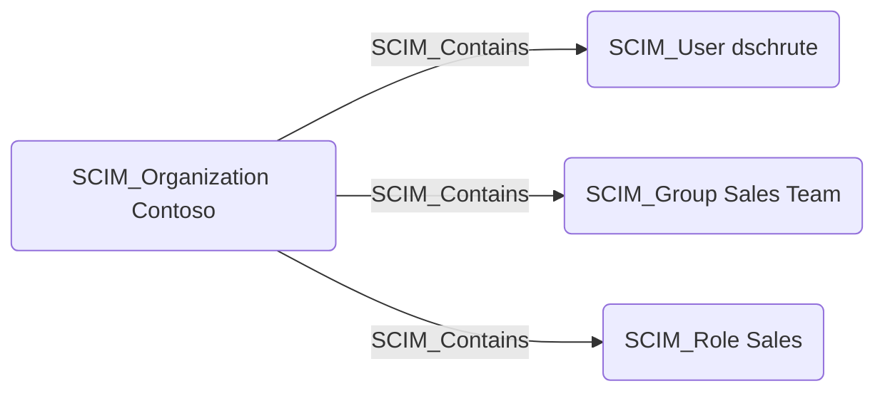

## Edge Schema

- Source: [SCIM_Organization](https://github.com/SpecterOps/bloodhound-docs/blob/main//opengraph/extensions/scim/nodes/scim_organization)
- Destination: [SCIM_User](https://github.com/SpecterOps/bloodhound-docs/blob/main//opengraph/extensions/scim/nodes/scim_user), [SCIM_Group](https://github.com/SpecterOps/bloodhound-docs/blob/main//opengraph/extensions/scim/nodes/scim_group), [SCIM_Role](https://github.com/SpecterOps/bloodhound-docs/blob/main//opengraph/extensions/scim/nodes/scim_role)
- Traversable: ✅

## General Information

The SCIM_Contains edge represents the containment relationship between an organization and its SCIM resources. Each SCIM user, group, and role belongs to exactly one organization, establishing a clear ownership boundary. This edge is significant for scoping identity governance — all resources contained by an organization are managed by that organization's identity provider.

