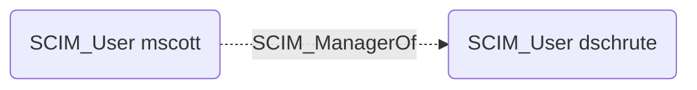

## Edge Schema

- Source: [SCIM_User](https://github.com/SpecterOps/bloodhound-docs/blob/main//opengraph/extensions/scim/nodes/scim_user)
- Destination: [SCIM_User](https://github.com/SpecterOps/bloodhound-docs/blob/main//opengraph/extensions/scim/nodes/scim_user)
- Traversable: ❌

## General Information

The SCIM_ManagerOf edge represents the managerial relationship between users, as defined by the `manager` attribute in the SCIM Enterprise User schema extension. This edge captures the organizational hierarchy, connecting a manager to their direct reports. Manager relationships can be significant for understanding organizational structure and potential privilege escalation paths through social engineering or delegated approval workflows.

