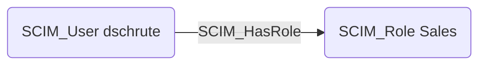

## Edge Schema

- Source: [SCIM_User](https://github.com/SpecterOps/bloodhound-docs/blob/main//opengraph/extensions/scim/reference/nodes/scim_user)
- Destination: [SCIM_Role](https://github.com/SpecterOps/bloodhound-docs/blob/main//opengraph/extensions/scim/reference/nodes/scim_role)
- Traversable: ✅

## General Information

The [SCIM_HasRole](https://github.com/SpecterOps/bloodhound-docs/blob/main//opengraph/extensions/scim/reference/edges/scim_hasrole) edge represents the relationship between users and their assigned roles, as defined by the `roles` attribute in the SCIM user schema. Roles are extracted from user attributes and represented as separate nodes to enable graph-based analysis of role assignments across the organization. This edge allows identifying all users who share a particular role.

