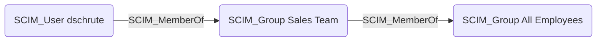

## Edge Schema

- Source: [SCIM_User](https://github.com/SpecterOps/bloodhound-docs/blob/main//opengraph/extensions/scim/reference/nodes/scim_user), [SCIM_Group](https://github.com/SpecterOps/bloodhound-docs/blob/main//opengraph/extensions/scim/reference/nodes/scim_group)
- Destination: [SCIM_Group](https://github.com/SpecterOps/bloodhound-docs/blob/main//opengraph/extensions/scim/reference/nodes/scim_group)
- Traversable: ✅

## General Information

The [SCIM_MemberOf](https://github.com/SpecterOps/bloodhound-docs/blob/main//opengraph/extensions/scim/reference/edges/scim_memberof) edge represents group membership relationships, as defined by the `members` attribute of groups and the `groups` attribute of users in the SCIM schema. Users can be members of groups, and groups can be nested within other groups. Group membership propagated through SCIM is a primary mechanism for granting application access, making these edges critical for understanding transitive access paths.

