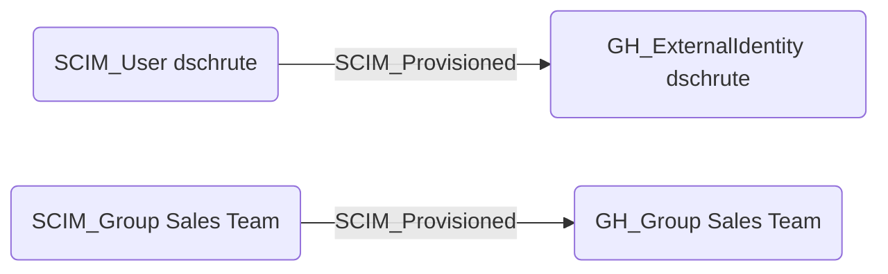

## Edge Schema

- Source: [SCIM_User](https://github.com/SpecterOps/bloodhound-docs/blob/main//opengraph/extensions/scim/reference/nodes/scim_user), [SCIM_Group](https://github.com/SpecterOps/bloodhound-docs/blob/main//opengraph/extensions/scim/reference/nodes/scim_group)
- Destination: [GH_ExternalIdentity](https://bloodhound.specterops.io/opengraph/extensions/githound/reference/nodes/gh_externalidentity), [GH_Group](https://bloodhound.specterops.io/opengraph/extensions/githound/reference/nodes/gh_group)
- Traversable: ✅

## General Information

The [SCIM_Provisioned](https://github.com/SpecterOps/bloodhound-docs/blob/main//opengraph/extensions/scim/reference/edges/scim_provisioned) edge represents the hybrid relationship between SCIM resources and their provisioned counterparts in downstream applications, such as GitHub. When an identity provider provisions a user or group via SCIM, this edge connects the SCIM source identity to the resulting application-specific identity. These edges are critical for tracing cross-domain access paths from cloud IdP identities to application-level permissions.

