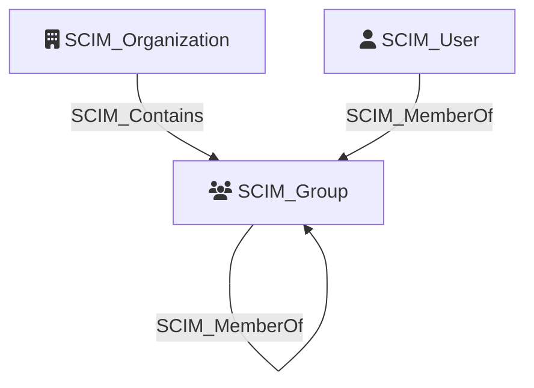

Represents a group resource provisioned via the [System for Cross-domain Identity Management (SCIM)](https://scim.cloud/) protocol. SCIM groups are used by identity providers to organize users and manage access to downstream applications. Group membership changes propagated through SCIM can grant or revoke application access, making groups a key control point for identity governance.

## Edges

<Note>
The tables below list edges defined by the SCIM extension only. Additional edges to or from this node may be created by other extensions.
</Note>

### Inbound Edges

| Edge Type | Source Node Types | Traversable |
| --------- | ----------------- | ----------- |
| [SCIM_Contains](https://github.com/SpecterOps/bloodhound-docs/blob/main//opengraph/extensions/scim/reference/edges/scim_contains) | [SCIM_Organization](https://github.com/SpecterOps/bloodhound-docs/blob/main//opengraph/extensions/scim/reference/nodes/scim_organization) | ✅ |
| [SCIM_MemberOf](https://github.com/SpecterOps/bloodhound-docs/blob/main//opengraph/extensions/scim/reference/edges/scim_memberof) | [SCIM_User](https://github.com/SpecterOps/bloodhound-docs/blob/main//opengraph/extensions/scim/reference/nodes/scim_user), [SCIM_Group](https://github.com/SpecterOps/bloodhound-docs/blob/main//opengraph/extensions/scim/reference/nodes/scim_group) | ✅ |

### Outbound Edges

| Edge Type | Destination Node Types | Traversable |
| --------- | ---------------------- | ----------- |
| [SCIM_MemberOf](https://github.com/SpecterOps/bloodhound-docs/blob/main//opengraph/extensions/scim/reference/edges/scim_memberof) | [SCIM_Group](https://github.com/SpecterOps/bloodhound-docs/blob/main//opengraph/extensions/scim/reference/nodes/scim_group) | ✅ |
| [SCIM_Provisioned](https://github.com/SpecterOps/bloodhound-docs/blob/main//opengraph/extensions/scim/reference/edges/scim_provisioned) | [GH_ExternalIdentity](https://bloodhound.specterops.io/opengraph/extensions/github/nodes/gh_externalidentity), [GH_Group](https://bloodhound.specterops.io/opengraph/extensions/github/nodes/gh_group) | ✅ |

## Properties

| Property | SCIM Property | Type | Description | Sample Value |
| --- | --- | --- | --- | --- |
| `id` | `id`  | `string` | The unique identifier of the group. | `2819c223-7f76-453a-919d-413861904646` |
| `displayName` | `displayName` | `string` | The display name of the group. | `Sales Team` |
| `created` | `meta.created` | `datetime` | The date and time the group was created. | `2010-01-23T04:56:22Z` |
| `lastModified` | `meta.lastModified` | `datetime` | The date and time the group was last modified. | `2011-05-13T04:42:34Z` |

## Diagram

