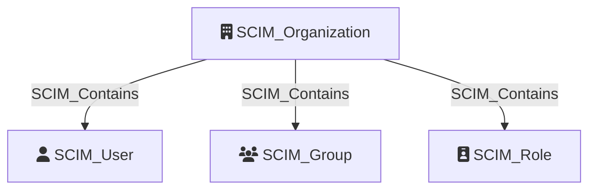

Represents a synchronized organization or tenant in the identity provider (IdP). An application may synchronize users and groups from multiple organizations or tenants via SCIM. The `SCIM_Organization` node serves as the root container for all SCIM resources belonging to a given tenant, providing a clear boundary for identity governance and access control.

## Edges

<Note>
The tables below list edges defined by the SCIM extension only. Additional edges to or from this node may be created by other extensions.
</Note>

### Inbound Edges

No inbound edges are defined by the SCIM extension for this node.

### Outbound Edges

| Edge Type | Destination Node Types | Traversable |
| --------- | ---------------------- | ----------- |
| [SCIM_Contains](https://github.com/SpecterOps/bloodhound-docs/blob/main//opengraph/extensions/scim/reference/edges/scim_contains) | [SCIM_User](https://github.com/SpecterOps/bloodhound-docs/blob/main//opengraph/extensions/scim/reference/nodes/scim_user), [SCIM_Group](https://github.com/SpecterOps/bloodhound-docs/blob/main//opengraph/extensions/scim/reference/nodes/scim_group), [SCIM_Role](https://github.com/SpecterOps/bloodhound-docs/blob/main//opengraph/extensions/scim/reference/nodes/scim_role) | ✅ |

## Properties

| Property | Type | Description | Sample Value |
| --- | --- | --- | --- |
| `id` | `string` | The unique identifier of the organization or tenant. | `contoso.com` |
| `displayName` | `string` | The display name of the organization or tenant. | `Contoso` |
| `url` | `string (uri)` | The URL of the organization or tenant in the IdP. | `https://contoso.com/scim` |

## Diagram

