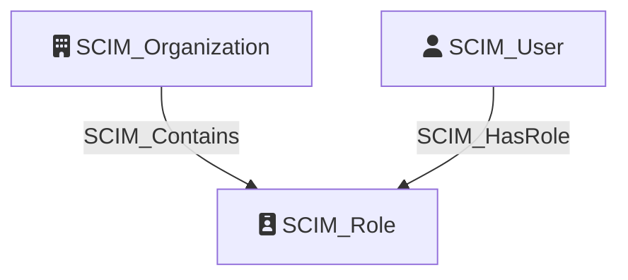

Represents a role derived from the `roles` attribute of SCIM users. In SCIM, roles are typically multi-valued string attributes on user resources rather than standalone objects. To enable graph-based analysis, we create `SCIM_Role` nodes to represent each unique role, allowing visibility into which users share the same role assignments across the organization.

## Edges

<Note>
The tables below list edges defined by the SCIM extension only. Additional edges to or from this node may be created by other extensions.
</Note>

### Inbound Edges

| Edge Type | Source Node Types | Traversable |
| --------- | ----------------- | ----------- |
| [SCIM_Contains](https://github.com/SpecterOps/bloodhound-docs/blob/main//opengraph/extensions/scim/reference/edges/scim_contains) | [SCIM_Organization](https://github.com/SpecterOps/bloodhound-docs/blob/main//opengraph/extensions/scim/reference/nodes/scim_organization) | ✅ |
| [SCIM_HasRole](https://github.com/SpecterOps/bloodhound-docs/blob/main//opengraph/extensions/scim/reference/edges/scim_hasrole) | [SCIM_User](https://github.com/SpecterOps/bloodhound-docs/blob/main//opengraph/extensions/scim/reference/nodes/scim_user) | ✅ |

### Outbound Edges

No outbound edges are defined by the SCIM extension for this node.

## Properties

| Property | SCIM Property | Type | Description | Sample Value |
| --- | --- | --- | --- | --- |
| `id` | `User.roles` | `string` | The unique identifier of the role. | `8de4e0ea7370e4e60a521379c9edf3253afcba7660e647f3aa788e49e8993d1a` |
| `name` | `User.roles` | `string` | The name of the role. | `Sales` |

## Diagram

