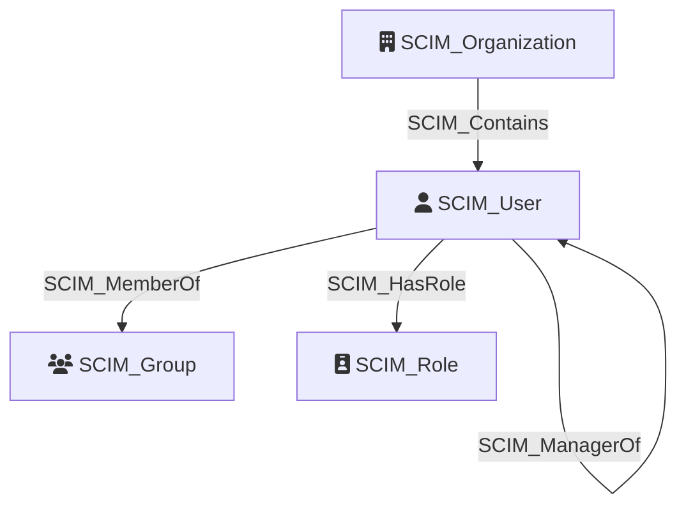

Represents a user account provisioned via the [System for Cross-domain Identity Management (SCIM)](https://scim.cloud/) protocol. SCIM users are created and managed by cloud identity providers (IdPs) such as Okta or Entra ID, which synchronize user identities to downstream applications. A compromised SCIM user account may grant access to any application the user is provisioned to, and the `externalId` links back to the user's identity in the source IdP.

## Edges

<Note>
The tables below list edges defined by the SCIM extension only. Additional edges to or from this node may be created by other extensions.
</Note>

### Inbound Edges

| Edge Type | Source Node Types | Traversable |
| --------- | ----------------- | ----------- |
| [SCIM_Contains](https://github.com/SpecterOps/bloodhound-docs/blob/main//opengraph/extensions/scim/reference/edges/scim_contains) | [SCIM_Organization](https://github.com/SpecterOps/bloodhound-docs/blob/main//opengraph/extensions/scim/reference/nodes/scim_organization) | ✅ |
| [SCIM_ManagerOf](https://github.com/SpecterOps/bloodhound-docs/blob/main//opengraph/extensions/scim/reference/edges/scim_managerof) | [SCIM_User](https://github.com/SpecterOps/bloodhound-docs/blob/main//opengraph/extensions/scim/reference/nodes/scim_user) | ❌ |

### Outbound Edges

| Edge Type | Destination Node Types | Traversable |
| --------- | ---------------------- | ----------- |
| [SCIM_HasRole](https://github.com/SpecterOps/bloodhound-docs/blob/main//opengraph/extensions/scim/reference/edges/scim_hasrole) | [SCIM_Role](https://github.com/SpecterOps/bloodhound-docs/blob/main//opengraph/extensions/scim/reference/nodes/scim_role) | ✅ |
| [SCIM_ManagerOf](https://github.com/SpecterOps/bloodhound-docs/blob/main//opengraph/extensions/scim/reference/edges/scim_managerof) | [SCIM_User](https://github.com/SpecterOps/bloodhound-docs/blob/main//opengraph/extensions/scim/reference/nodes/scim_user) | ❌ |
| [SCIM_MemberOf](https://github.com/SpecterOps/bloodhound-docs/blob/main//opengraph/extensions/scim/reference/edges/scim_memberof) | [SCIM_Group](https://github.com/SpecterOps/bloodhound-docs/blob/main//opengraph/extensions/scim/reference/nodes/scim_group) | ✅ |
| [SCIM_Provisioned](https://github.com/SpecterOps/bloodhound-docs/blob/main//opengraph/extensions/scim/reference/edges/scim_provisioned) | [GH_ExternalIdentity](https://bloodhound.specterops.io/opengraph/extensions/github/nodes/gh_externalidentity), [GH_Group](https://bloodhound.specterops.io/opengraph/extensions/github/nodes/gh_group) | ✅ |

## Properties

| Property | SCIM Property | Type | Description | Sample Value |
| --- | --- | --- | --- | --- |
| `id` | `id` | `string` | Unique identifier for the SCIM resource as defined by the Service Provider; stable and non-reassignable. | `2819c223-7f76-453a-919d-413861904646` |
| `externalId` | `externalId` | `string` | Identifier defined by the SCIM client for cross-system correlation. | `dschrute` |
| `userName` | `userName` | `string` | Unique user identifier used for authentication or display; required. | `dschrute` |
| `enabled` | `active` | `boolean` | Whether the user account is active. | `true` |
| `displayName` | `displayName` / `name.formatted` | `string` | Display name for the user. | `Dwight Schrute` |
| `givenName` | `name.givenName` | `string` | Given (first) name. | `Dwight` |
| `familyName` | `name.familyName` | `string` | Family (last) name. | `Schrute` |
| `middleName` | `name.middleName` | `string` | Middle name(s). | `Kurt` |
| `honorificPrefix` | `name.honorificPrefix` | `string` | Honorific prefix (title). | `Mr.` |
| `honorificSuffix` | `name.honorificSuffix` | `string` | Honorific suffix. | `Jr.` |
| `title` | `title` | `string` | Job title. | `Assistant to the Regional Manager` |
| `userType` | `userType` | `string` | Organization-to-user relationship type. | `Employee` |
| `profileUrl` | `profileUrl` | `string (uri)` | URL to the user's profile page. | `https://example.com/dschrute` |
| `mail` | `emails.primary` | `string` | Primary email address from `emails` where `primary=true`. | `dschrute@example.com` |
| `otherMails` | `emails` | `string[]` | Secondary email addresses from other `emails` entries. | `["dschrute@contoso.com"]` |
| `role` | `roles` | `string[]` | Role names from the user's `roles` attribute. | `["Sales", "Management"]` |
| `employeeNumber` | `employeeNumber` | `string` | Enterprise user employee number. | `12345` |
| `organization` | `organization` | `string` | Enterprise user organization name. | `Contoso` |
| `department` | `department` | `string` | Enterprise user department name. | `Sales` |
| `managerId` | `manager.managerId` | `string` | Identifier of the user's manager. | `2819c223-7f76-453a-919d-413861904646` |
| `created` | `meta.created` | `datetime` | Resource creation timestamp. | `2010-01-23T04:56:22Z` |
| `lastModified` | `meta.lastModified` | `datetime` | Resource last modified timestamp. | `2011-05-13T04:42:34Z` |

<Info>
Most attributes use 1:1 mapping, but some, such as `mail` and `otherMails`,
are transformed from multi-valued SCIM attributes like `emails`.
</Info>
## Diagram

