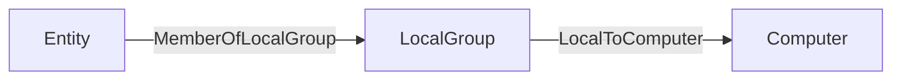

# Schema

In this section, you will find all the information to create a JSON file that BloodHound can ingest and use to display your Nodes and Edges.

The most up-to-date JSON Schema can always be found in our CE repository. Currently, the location of the node and edge schema files in our source code can be found [here](https://github.com/SpecterOps/BloodHound/tree/main/cmd/api/src/services/upload/jsonschema).

# Ingesting Generic Formatted Data

## File Requirements

Acceptable formats: `.json`, `.zip`

You can mix file types in a single upload (e.g. Sharphound + Generic).

Compressed ZIPs containing multiple file types are supported.

## JSON Format

The standard BloodHound UI upload screen now accepts files in a generic format. You can continue using it as before.

At minimum, your JSON file should have these elements:

``` JSON
{
  "graph": {
    "nodes": [],
    "edges": []
  }
}
```

The `nodes` and `edges` must conform to our JSON Schema, see details below. The validation of the data occurs at upload time.

When ingest completes, the generic data will be available via **Cypher search ONLY**. Generic data is not searchable via the pathfinding feature (yet).

**Entity Panels**: clicking on a generic node or edge will only render the entity’s property bag. At this time there is no support for defining entity panels for generic entities.


## Nodes

### Property Rules

Properties must be primitive types or arrays of primitive types

Nested objects and arrays of objects are not allowed

Arrays must be homogeneous (e.g. all strings or all numbers)

An array of kind labels for the node. The first element is treated as the node's primary kind and is used to determine which icon to display in the graph UI. This primary kind is only used for visual representation and has no semantic significance for data processing.

### Node JSON
``` JSON
{
    "title": "Generic Ingest Node",
    "description": "A node used in a generic graph ingestion system. Each node must have a unique identifier (`id`) and at least one kind describing its role or type. Nodes may also include a `properties` object containing custom attributes.",
    "type": "object",
    "properties": {
        "id": { "type": "string" },
        "properties": {
            "type": ["object", "null"],
            "description": "A key-value map of node attributes. Values must not be objects. If a value is an array, it must contain only primitive types (e.g., strings, numbers, booleans) and must be homogeneous (all items must be of the same type).",
            "additionalProperties": {
                "type": ["string", "number", "boolean", "array"],
                "items": {
                    "not": {
                        "type": "object"
                    }
                }
            }
        },
        "kinds": {
            "type": ["array"],
            "items": { "type": "string" },
            "maxItems": 3,
            "minItems": 1,
            "description": "An array of kind labels for the node. The first element is treated as the node's primary kind and is used to determine which icon to display in the graph UI. This primary kind is only used for visual representation and has no semantic significance for data processing."
        }
    },
    "required": ["id", "kinds"],
    "examples": [
        {
            "id": "user-1234",
            "kinds": ["Person"]
        },
        {
            "id": "device-5678",
            "properties": {
                "manufacturer": "Brandon Corp",
                "model": "4000x",
                "isActive": true,
                "rating": 43.50
            },
            "kinds": ["Device", "Asset"]
        },
        {
            "id": "location-001",
            "properties": null,
            "kinds": ["Location"]
        }
    ]
}
```


## Edges

Edges names cannot contain dash `-`. It is highly recommended to use Pascal Case and no special characters.

From [tuple.nl](https://www.tuple.nl/en/knowledge-base/pascal-case): Pascal Case is a naming convention used in programming where compound words are written without spaces, and each word starts with an uppercase letter. It is commonly used for naming variables, functions, classes, and other identifiers in code. Pascal Case helps create descriptive and easily distinguishable names, contributing to the clarity of your code. 

See Neo4j [Naming and Conventions](https://neo4j.com/docs/cypher-manual/current/syntax/naming/) for more details. 

### Edge JSON
``` JSON
{
    "title": "Generic Ingest Edge",
    "description": "Defines an edge between two nodes in a generic graph ingestion system. Each edge specifies a start and end node using either a unique identifier (id) or a name-based lookup. A kind is required to indicate the relationship type. Optional properties may include custom attributes. You may optionally constrain the start or end node to a specific kind using the kind field inside each reference.",
    "type": "object",
    "properties": {
        "start": {
            "type": "object",
            "properties": {
                "match_by": {
                    "type": "string",
                    "enum": ["id", "name"],
                    "default": "id",
                    "description": "Whether to match the start node by its unique object ID or by its name property."
                },
                "value": {
                    "type": "string",
                    "description": "The value used for matching — either an object ID or a name, depending on match_by."
                },
                "kind": {
                    "type": "string",
                    "description": "Optional kind filter; the referenced node must have this kind."
                }
            },
            "required": ["value"]
        },
        "end": {
            "type": "object",
            "properties": {
                "match_by": {
                    "type": "string",
                    "enum": ["id", "name"],
                    "default": "id",
                    "description": "Whether to match the end node by its unique object ID or by its name property."
                },
                "value": {
                    "type": "string",
                    "description": "The value used for matching — either an object ID or a name, depending on match_by."
                },
                "kind": {
                    "type": "string",
                    "description": "Optional kind filter; the referenced node must have this kind."
                }
            },
            "required": ["value"]
        },
        "kind": { "type": "string" },
        "properties": {
            "type": ["object", "null"],
            "description": "A key-value map of edge attributes. Values must not be objects. If a value is an array, it must contain only primitive types (e.g., strings, numbers, booleans) and must be homogeneous (all items must be of the same type).",
            "additionalProperties": {
                "type": ["string", "number", "boolean", "array"],
                "items": {
                    "not": {
                        "type": "object"
                    }
                }
            }
        }
    },
    "required": ["start", "end", "kind"],
    "examples": [
        {
            "start": {
                "match_by": "id",
                "value": "user-1234"
            },
            "end": {
                "match_by": "id",
                "value": "server-5678"
            },
            "kind": "HasSession",
            "properties": {
                "timestamp": "2025-04-16T12:00:00Z",
                "duration_minutes": 45
            }
        },
        {
            "start": {
                "match_by": "name",
                "value": "alice",
                "kind": "User"
            },
            "end": {
                "match_by": "name",
                "value": "file-server-1",
                "kind": "Server"
            },
            "kind": "AccessedResource",
            "properties": {
                "via": "SMB",
                "sensitive": true
            }
        },
        {
            "start": {
                "value": "admin-1"
            },
            "end": {
                "value": "domain-controller-9"
            },
            "kind": "AdminTo",
            "properties": {
                "reason": "elevated_permissions",
                "confirmed": false
            }
        },
        {
            "start": {
                "match_by": "name",
                "value": "Printer-007"
            },
            "end": {
                "match_by": "id",
                "value": "network-42"
            },
            "kind": "ConnectedTo",
            "properties": null
        }
    ]
}
```

### Post-processing

Post-processing in BloodHound refers to the analysis phase where the system creates certain edges after ingesting data to identify attack paths.

After ingesting data, BloodHound analyzes the graph state and adds edges it considers useful. BloodHound regenerates "post-processed" edges after it builds a complete graph. Before regenerating post-processed edges, BloodHound deletes any existing ones. As a result, BloodHound removes any post-processed edges that you add directly to an OpenGraph payload.

<Accordion title="Show post-processed edges">
BloodHound creates the following edges during post-processing:

- [`ADCSESC1`](https://github.com/SpecterOps/bloodhound-docs/blob/main//resources/edges/adcs-esc1)
- [`ADCSESC3`](https://github.com/SpecterOps/bloodhound-docs/blob/main//resources/edges/adcs-esc3)
- [`ADCSESC4`](https://github.com/SpecterOps/bloodhound-docs/blob/main//resources/edges/adcs-esc4)
- [`ADCSESC6a`](https://github.com/SpecterOps/bloodhound-docs/blob/main//resources/edges/adcs-esc6a)
- [`ADCSESC6b`](https://github.com/SpecterOps/bloodhound-docs/blob/main//resources/edges/adcs-esc6b)
- [`ADCSESC9a`](https://github.com/SpecterOps/bloodhound-docs/blob/main//resources/edges/adcs-esc9a)
- [`ADCSESC9b`](https://github.com/SpecterOps/bloodhound-docs/blob/main//resources/edges/adcs-esc9b)
- [`ADCSESC10a`](https://github.com/SpecterOps/bloodhound-docs/blob/main//resources/edges/adcs-esc10a)
- [`ADCSESC10b`](https://github.com/SpecterOps/bloodhound-docs/blob/main//resources/edges/adcs-esc10b)
- [`ADCSESC13`](https://github.com/SpecterOps/bloodhound-docs/blob/main//resources/edges/adcs-esc13)
- [`AddMember`](https://github.com/SpecterOps/bloodhound-docs/blob/main//resources/edges/add-member)
- [`AdminTo`](https://github.com/SpecterOps/bloodhound-docs/blob/main//resources/edges/admin-to)
- [`AZAddOwner`](https://github.com/SpecterOps/bloodhound-docs/blob/main//resources/edges/az-add-owner)
- [`AZMGAddMember`](https://github.com/SpecterOps/bloodhound-docs/blob/main//resources/edges/az-mg-add-member)
- [`AZMGAddOwner`](https://github.com/SpecterOps/bloodhound-docs/blob/main//resources/edges/az-mg-add-owner)
- [`AZMGAddSecret`](https://github.com/SpecterOps/bloodhound-docs/blob/main//resources/edges/az-mg-add-secret)
- [`AZMGGrantAppRoles`](https://github.com/SpecterOps/bloodhound-docs/blob/main//resources/edges/az-mg-grant-app-roles)
- [`AZMGGrantRole`](https://github.com/SpecterOps/bloodhound-docs/blob/main//resources/edges/az-mg-grant-role)
- [`AZRoleApprover`](https://github.com/SpecterOps/bloodhound-docs/blob/main//resources/edges/az-role-approver)
- [`CanPSRemote`](https://github.com/SpecterOps/bloodhound-docs/blob/main//resources/edges/can-ps-remote)
- [`CanRDP`](https://github.com/SpecterOps/bloodhound-docs/blob/main//resources/edges/can-rdp)
- [`CoerceAndRelayNTLMToADCS`](https://github.com/SpecterOps/bloodhound-docs/blob/main//resources/edges/coerce-and-relay-ntlm-to-adcs)
- [`CoerceAndRelayNTLMToLDAP`](https://github.com/SpecterOps/bloodhound-docs/blob/main//resources/edges/coerce-and-relay-ntlm-to-ldap)
- [`CoerceAndRelayNTLMToLDAPS`](https://github.com/SpecterOps/bloodhound-docs/blob/main//resources/edges/coerce-and-relay-ntlm-to-ldaps)
- [`CoerceAndRelayNTLMToSMB`](https://github.com/SpecterOps/bloodhound-docs/blob/main//resources/edges/coerce-and-relay-ntlm-to-smb)
- [`DCSync`](https://github.com/SpecterOps/bloodhound-docs/blob/main//resources/edges/dc-sync)
- [`EnrollOnBehalfOf`](https://github.com/SpecterOps/bloodhound-docs/blob/main//resources/edges/enroll-on-behalf-of)
- [`EnterpriseCAFor`](https://github.com/SpecterOps/bloodhound-docs/blob/main//resources/edges/enterprise-ca-for)
- [`ExecuteDCOM`](https://github.com/SpecterOps/bloodhound-docs/blob/main//resources/edges/execute-dcom)
- [`ExtendedByPolicy`](https://github.com/SpecterOps/bloodhound-docs/blob/main//resources/edges/extended-by-policy)
- [`GoldenCert`](https://github.com/SpecterOps/bloodhound-docs/blob/main//resources/edges/golden-cert)
- [`HasTrustKeys`](https://github.com/SpecterOps/bloodhound-docs/blob/main//resources/edges/has-trust-keys)
- [`IssuedSignedBy`](https://github.com/SpecterOps/bloodhound-docs/blob/main//resources/edges/issued-signed-by)
- [`Owns`](https://github.com/SpecterOps/bloodhound-docs/blob/main//resources/edges/owns)
- [`ProtectAdminGroups`](https://github.com/SpecterOps/bloodhound-docs/blob/main//resources/edges/protect-admin-groups)
- [`SyncLAPSPassword`](https://github.com/SpecterOps/bloodhound-docs/blob/main//resources/edges/sync-laps-password)
- [`SyncedToADUser`](https://github.com/SpecterOps/bloodhound-docs/blob/main//resources/edges/synced-to-ad-user)
- [`SyncedToEntraUser`](https://github.com/SpecterOps/bloodhound-docs/blob/main//resources/edges/synced-to-entra-user)
- [`TrustedForNTAuth`](https://github.com/SpecterOps/bloodhound-docs/blob/main//resources/edges/trusted-for-nt-auth)
- [`WriteOwner`](https://github.com/SpecterOps/bloodhound-docs/blob/main//resources/edges/write-owner)

</Accordion>

You can work around this behavior by including the supporting edges that cause the post-processing step to generate the edge that you want.

For example, if you include an `AdminTo` edge directly in your OpenGraph payload, BloodHound removes it during post-processing and the edge does not persist in the final graph as expected. Instead of adding `AdminTo` edges directly, include the supporting edges that cause the post-processor to generate the `AdminTo` edge. The common pattern that triggers the creation of the `AdminTo` edge is:



See the following example OpenGraph payload that produces the effect:

```json
{
    "graph": {
        "nodes": [
            {
                "id": "TESTNODE",
                "kinds": ["User"]
            }
        ],
        "edges": [
            {
                "start": {
                    "match_by": "id",
                    "value": "TESTNODE"
                },
                "end": {
                    "match_by": "id",
                    "value": "S-1-5-21-2697957641-2271029196-387917394-2171-544"
                },
                "kind": "MemberOfLocalGroup"
            }
        ]
    }
}
```

## Optional Metadata Field

You can optionally include a metadata object at the top level of your JSON payload. This metadata currently supports a single field:

    - `source_kind`: a string that applies to all nodes in the file, used to attribute a source to ingested nodes (e.g.  Github, Snowflake, MSSQL). This is useful for tracking where a node originated. We internally use this concept already for AD/Azure, using the labels “Base” and “AZBase” respectively.

Example:
``` JSON
{
  "metadata": {
    "source_kind": "GHBase"
  },
  "graph": {
    "nodes": [],
    "edges": []
  }
}
```
If present, the `source_kind` will be added to the `kinds` list of all nodes in the file during ingest. This feature is optional.

## Minimal Working JSON
The following is the most simple JSON file we could come up with. You can use it as a starting point to build your own Open Graph.

``` JSON
{
  "graph": {
    "nodes": [
      {
        "id": "123",
        "kinds": [
          "Person",
          "Base"
        ],
        "properties": {
          "displayname": "bob",
          "property": "a",
          "objectid": "123",
          "name": "BOB"
        }
      },
      {
        "id": "234",
        "kinds": [
          "Person",
          "Base"
        ],
        "properties": {
          "displayname": "alice",
          "property": "b",
          "objectid": "234",
          "name": "ALICE"
        }
      }
    ],
    "edges": [
      {
        "kind": "Knows",
        "start": {
          "value": "123",
          "match_by": "id"
        },
        "end": {
          "value": "234",
          "match_by": "id"
        }
      }
    ]
  }
}
```

To test the ingestion in your BloodHound instance, navigate to **Explore** → **Cypher**. Enter the following query and hit `Run`:

``` Cypher
match p=()-[:Knows]-()
return p
```

You should get something that looks like this:
Knows->Alice"/>
